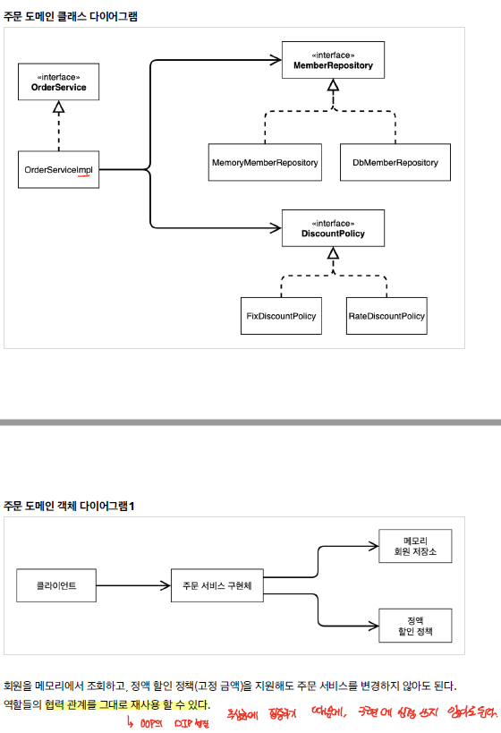

# Design Pattern

디자인 패턴이란, 시스템 설계 시 발생할 수 있는 문제에 대한 해결방안을 정의 해놓은 규약으로, 자칫하면 시간이 오래 걸릴 수 수 있는 문제들을 디자인 패턴을 통해 해결할 수 있다.

## Terms
> 라이브러리

어떠한 기능을 수행하기 위해 도움을 주기 위해 각종 함수들을 모아놓은 모듈이며, 필요에 따라 기능을 호출하여 사용하면 된다.

- itertools, math, 등 pip로 설치되는 패키지
- npm으로 설치되는 패키지 등

> 프레임워크

필수적인 코드, 알고리즘 등과 같이 어느정도의 구조를 가지고 있고, 사용자는 그 뼈대 위에서 애플리케이션을 개발하게 된다. 

- Spring
- Django, Flask
- Android

라이브러리와 프레임워크는 공통으로 사용될 수 있는 변수, 함수 등을 모듈화 시킨것을 의미하며, 이 둘의 차이는 어디에 제어 흐름이 어딨는가가 중요하다.

라이브러리의 경우, 사용자가 직접 기능을 호출하여 애플리케이션 코드의 흐름을 제어하게 되지만, 프레이워크의 경우 기본적인 골격을 가지고 있어, 실행 흐름이 프레임워크가 설계되어 있는 대로 흘러가게 된다. 이를 보고 IoC(Inversion Of Control), 즉 실행 흐름이 framework에 위임 된다.

## Singleton Pattern

싱글톤 패턴은 애플리케이션 동작과정에서 하나의 클래스에 대해서 하나의 인스턴스만을 가지는 패턴이다. 즉, 추가적인 인스턴스 생성을 제한하고, 하나의 인스턴스만을 통해 여러 로직에서 공유하게 된다. 

대표적으로, DB Connection에서 singleton을 많이 활용한다.

> java singleton pattern

```java
class Singleton {
    private static class singleInstanceHolder {
        //final 키워드를 이용해서 변경이 불가능하도록 설정
        private static final Singleton INSTANCE = new Singleton();
    }
    //private constructor을 이용해서 추가적인 인스턴스 생성을 방지한다.
    private Singleton(){

    }
    //객체를 반환받을 때는 static factory 방식으로 객체를 반환하도록 한다.
    public static Singleton getInstance() {
        return singleInstanceHolder.INSTANCE;
    }
}

public class HelloWorld{ 
     public static void main(String []args){ 
        Singleton a = Singleton.getInstance(); 
        Singleton b = Singleton.getInstance(); 
        System.out.println(a.hashCode());
        System.out.println(b.hashCode());  
        if (a == b){
         System.out.println(true); 
        } 
     }
}
```

하지만, singleton 방식을 활용할 경우, TDD 개발방식에서는 문제가 발생할 수 있다. singleton 인스턴스는 여러 로직에서 공유되어 사용되기 때문에 테스트 간에 독립적인 환경을 보장할 수 없다.

singleton pattern을 이용하게 되면 모듈간의 결합이 발생하는 문제가 발생하게 되는데, 이때 DI를 활용한다.

```java
public class SpellChecker {
    private final Lexicon dictionary;
    
    // 여기서 의존성 주입을!
    public SpellChecker(Lexicon dictionary){
        this.dictionary = Objects.requireNotNull(dictionary);
    }
    
    public static boolean isVaild(String word) {...}
    public static List<String> suggestions(String typo) {...}
        }
```

자원을 직접 할당하는 것이 아니라, 외부에서 모듈을 주입을 할 수 있도록 한다. interface에 의존하는 형식으로 설계하여 하위 모듈에 대한 의존성을 낮추고, 어떠한 구현 클래스를 주입하더라도 정상적으로 동작하도록 한다.

하지만, DI와 같은 중간 계층이 늘어남에 따라 런타임 시간이 늘어나는 문제는 있다.


### IoC
IoC 제어의 역전(Inversion on Control): 클라이언트 코드인 (MemberServiceImpl, OrderServiceImpl)은 오직 자신의 로직/코드를 실행하는 역할만을 수행한다. 어떤 클래스가 구현 클래스로 오는 지를 알지 못한 상태로 자신의 역할만을 수행한다. 이 처럼, 프로그램의 제어 흐름을 자기 자신이 아니라 외부에서 통제하는 것을 제어의 역전이라고 한다. AppConfig 처럼 필요한 구현클래스들을 외부에서 정해주면, 서비스 코드는 그냥 받은대로 실행하기만 하면 된다.
### DI
DI 의존성 주입(Dependency Injection): 구현객체를 클라이언트에게 전달해서 이를 실제로 연결하는 작업을 DI라고 한다.

의존관계에는 크게 정적의존,동적의존이 있는데,



정적의존은 위 그림에서 클래스 다이어그램에 표현된 의존 관계를 뜻한다. 어플리케이션을 실행하지 않더라도 알 수 있는 의존관계이다. OrderService는 MemberRepository, DiscountPolicy와 의존관계다라는 것을 파악할 수 있다.

하지만 OrderService가 MemoryMemberRepository 나 DBMemberRepository 연결될지, FixDiscountPolicy, RateDiscountPolicy에 연결될지는 실행하지 않고는 모르는 것이다.

이처럼 실제 실행을 통해 의존관계가 연결되는 것을 동적인 의존관계라고 하며, 이는 객체 다이어그램의 의존 관계를 통해 알 수 있다.

동적 의존 관계 형성을 하는 것이 바로 DI이다. 

AppConfig 처럼 실제로 객체를 생성하고 연결해주는 작업을 진행하는 것이 *DI 컨테이너*이다. 이는 Spring에서 기본적으로 제공해주는 기능이다.

## Factory Pattern

객체 생성과 관련된 부분을 따로 분리하는 패턴으로, 상위클래스에서 클래스에 대한 중요한 뼈대를 구성하게 되고, 하위 클래스에서 구체적인 내용을 결정하는 패턴이다. 

상위 클래스에서는 객체 생성과 관련된 부분을 전혀 알 필요 없기 때문에 변경의 요지가 적다는 장점이 있다. 하위클래스가 추가 되면, Factory 클래스만 변경해주면 하위클래스를 정상적으로 사용할 수 있게 된다. 

상위클래스에서는 어떠한 구현 클래스가 넘어오는지에 대한 정보를 가지고 있지 않기 때문에, 하위 클래스에 대한 의존성을 낮추는 효과가 있다.


```java
abstract class Coffee { 
    public abstract int getPrice(); 
    
    @Override
    public String toString(){
        return "Hi this coffee is "+ this.getPrice();
    }
}

class CoffeeFactory { 
    public static Coffee getCoffee(String type, int price){
        if("Latte".equalsIgnoreCase(type)) return new Latte(price);
        else if("Americano".equalsIgnoreCase(type)) return new Americano(price);
        else{
            return new DefaultCoffee();
        } 
    }
}
class DefaultCoffee extends Coffee {
    private int price;

    public DefaultCoffee() {
        this.price = -1;
    }

    @Override
    public int getPrice() {
        return this.price;
    }
}
class Latte extends Coffee { 
    private int price; 
    
    public Latte(int price){
        this.price=price; 
    }
    @Override
    public int getPrice() {
        return this.price;
    } 
}
class Americano extends Coffee { 
    private int price; 
    
    public Americano(int price){
        this.price=price; 
    }
    @Override
    public int getPrice() {
        return this.price;
    } 
} 
public class HelloWorld{ 
     public static void main(String []args){ 
        Coffee latte = CoffeeFactory.getCoffee("Latte", 4000);
        Coffee ame = CoffeeFactory.getCoffee("Americano",3000); 
        System.out.println("Factory latte ::"+latte);
        System.out.println("Factory ame ::"+ame); 
     }
} 
```
상위 클래스인 Coffee 클래스는 어떠한 구체 클래스가 넘어오는지 전혀모르는 상황이다. Coffeefactory 메소드에 넘어가는 매개변수에 따라 반환형이 달라지게 된다. 

## Strategy Pattern

객체가 수행하는 동작을 바꿔주기 위해 직접 코드를 수정하기 않고, 기본적인 골격인 context에서 strategy만 바꿔주는 패턴이다. 


```java
public class ContextV1 {
    private Strategy strategy;

    public ContextV1(Strategy strategy) {
        this.strategy = strategy;
    }

    public void execute() {
        Long startTime = System.currentTimeMillis();
        //비즈니스 로직 시작
        strategy.call();
        //비즈니스 로직 종료
        Long endTime = System.currentTimeMillis();
        long resultTime = endTime - startTime;
        log.info("resultTime: {}", resultTime);
    }
}

@Slf4j
public class StrategyLogic1 implements Strategy{
    @Override
    public void call() {
        log.info("비즈니스 로직 1 실행");
    }
}

@Slf4j
public class StrategyLogic2 implements Strategy{
    @Override
    public void call() {
        log.info("비즈니스 로직 2 실행");
    }
}


@Test
void strategy1() {
    StrategyLogic1 strategyLogic1 = new StrategyLogic1();
    ContextV1 contextV1 = new ContextV1(strategyLogic1);
    contextV1.execute();

    StrategyLogic1 strategyLogic2 = new StrategyLogic1();
    ContextV1 contextV2 = new ContextV1(strategyLogic2);
    contextV1.execute();
}
```

```java
import java.text.DecimalFormat;
import java.util.ArrayList;
import java.util.List;
interface PaymentStrategy { 
    public void pay(int amount);
} 

class KAKAOCardStrategy implements PaymentStrategy {
    private String name;
    private String cardNumber;
    private String cvv;
    private String dateOfExpiry;
    
    public KAKAOCardStrategy(String nm, String ccNum, String cvv, String expiryDate){
        this.name=nm;
        this.cardNumber=ccNum;
        this.cvv=cvv;
        this.dateOfExpiry=expiryDate;
    }

    @Override
    public void pay(int amount) {
        System.out.println(amount +" paid using KAKAOCard.");
    }
} 

class LUNACardStrategy implements PaymentStrategy {
    private String emailId;
    private String password;
    
    public LUNACardStrategy(String email, String pwd){
        this.emailId=email;
        this.password=pwd;
    }
    
    @Override
    public void pay(int amount) {
        System.out.println(amount + " paid using LUNACard.");
    }
} 

class Item { 
    private String name;
    private int price; 
    public Item(String name, int cost){
        this.name=name;
        this.price=cost;
    }

    public String getName() {
        return name;
    }

    public int getPrice() {
        return price;
    }
} 

class ShoppingCart { 
    List<Item> items;
    
    public ShoppingCart(){
        this.items=new ArrayList<Item>();
    }
    
    public void addItem(Item item){
        this.items.add(item);
    }
    
    public void removeItem(Item item){
        this.items.remove(item);
    }
    
    public int calculateTotal(){
        int sum = 0;
        for(Item item : items){
            sum += item.getPrice();
        }
        return sum;
    }
    
    public void pay(PaymentStrategy paymentMethod){
        int amount = calculateTotal();
        paymentMethod.pay(amount);
    }
}  

public class HelloWorld{
    public static void main(String []args){
        ShoppingCart cart = new ShoppingCart();
        
        Item A = new Item("kundolA",100);
        Item B = new Item("kundolB",300);
        
        cart.addItem(A);
        cart.addItem(B);
        
        // pay by LUNACard
        cart.pay(new LUNACardStrategy("kundol@example.com", "pukubababo"));
        // pay by KAKAOBank
        cart.pay(new KAKAOCardStrategy("Ju hongchul", "123456789", "123", "12/01"));
    }
}
```

위의 2가지 예제를 보면 알듯이, strategy pattern을 이용해서 필요에 따라 동작을 변경해야되는 경우 위와 같이 해당 부분을 interface 형태로 구현해서 이를 외부에서 구현클래스를 주입한는 형태로 취한다.

만약, 구현해야되는 메소드가 한개인 경우에 대해서는 람다를 활용하는 방식도 고려해볼 수 있다.

node.js의 passport library도 strategy pattern이라고 할 수 있다.

oauth 전략을 활용하기 위한 라이브러리, LocalStrategy, facebook, kakao 등의 인증방식으로 전략으로 주입하여 사용한다.

```js
var passport = require('passport')
    , LocalStrategy = require('passport-local').Strategy;

passport.use(new LocalStrategy(
    function(username, password, done) {
        User.findOne({ username: username }, function (err, user) {
          if (err) { return done(err); }
            if (!user) {
                return done(null, false, { message: 'Incorrect username.' });
            }
            if (!user.validPassword(password)) {
                return done(null, false, { message: 'Incorrect password.' });
            }
            return done(null, user);
        });
    }
));
```

## Observer Pattern

어떠한 subject에 대한 상태변화를 체크하고 있다가, 상태변화가 발생하게 될때, 옵저버 목록에 있는 옵저버에 변화를 알려주는 패턴이다. 

한 객체의 상태가 변화할 때, 해당 객체 의존하는 다른 객체들에게 상태변화를 전이하는 것을 의미한다.

트위터의 경우 옵저버 패턴을 활용하는 서비스라고 생각할 수 있다. 
새로운 트윗이 올라올때, 팔로우를 한 구독자들에게 새로운 트윗이 올라왔음을 알려준다.

```java
import java.util.ArrayList;
import java.util.List;

interface Subject {
    public void register(Observer obj);
    public void unregister(Observer obj);
    public void notifyObservers();
    public Object getUpdate(Observer obj);
}

interface Observer {
    public void update(); 
}

class Topic implements Subject {
    private List<Observer> observers;
    private String message; 

    public Topic() {
        this.observers = new ArrayList<>();
        this.message = "";
    }

    @Override
    public void register(Observer obj) {
        if (!observers.contains(obj)) observers.add(obj); 
    }

    @Override
    public void unregister(Observer obj) {
        observers.remove(obj); 
    }

    @Override
    public void notifyObservers() {   
        this.observers.forEach(Observer::update); 
    }

    @Override
    public Object getUpdate(Observer obj) {
        return this.message;
    } 
    
    public void postMessage(String msg) {
        System.out.println("Message sended to Topic: " + msg);
        this.message = msg; 
        notifyObservers();
    }
}

class TopicSubscriber implements Observer {
    private String name;
    private Subject topic;

    public TopicSubscriber(String name, Subject topic) {
        this.name = name;
        this.topic = topic;
    }

    @Override
    public void update() {
        String msg = (String) topic.getUpdate(this); 
        System.out.println(name + ":: got message >> " + msg); 
    } 
}

public class HelloWorld { 
    public static void main(String[] args) {
        Topic topic = new Topic(); 
        Observer a = new TopicSubscriber("a", topic);
        Observer b = new TopicSubscriber("b", topic);
        Observer c = new TopicSubscriber("c", topic);
        topic.register(a);
        topic.register(b);
        topic.register(c); 
   
        topic.postMessage("amumu is op champion!!"); 
    }
}
```

위의 예제는 subject(topic)에 대해 변화(message 생성)이 발생했을 때 모든 observer(topicsubscriber)에 해당 변화(message)를 전이하게 된다.

## Proxy Pattern

프록시 패턴은 특정 객체에 대한 접근을 하기 이전에 흐름을 가로채어 해당 객체에 대한 인터페이스 역할을 수행하게 된다.
객체 실행에 앞서, 캐싱, 로깅, 등의 기능을 제공한다.


여기서 핵심은 Subject가 인터페이스라는 점이다. 따라서, Client는 Subject에 요청을 보내게 되므로, Subject를 구현하는 Proxy가 중간에 와서 매개체 역할을 수행한다 하더라도 Client의 코드에는 수정이 필요없다.

> Proxy

```java
@Slf4j
public class CacheProxy implements Subject{
    private Subject target;
    private String cacheValue;

    public CacheProxy(Subject target) {
        this.target = target;
    }

    @Override
    public String operation() {
        log.info("프록시 호출");
        if (cacheValue == null) {
            cacheValue = target.operation();
        }
        return cacheValue;
    }
}
```
Subject을 구현하는 Proxy class를 생성하게 되는데, 이때 Proxy class는 Subject를 멤버변수로 가지고 있다, 이는 실제 작업인 RealSubject을 호출하기 위함이다.

또한, cacheValue를 가지고 있어, 이미 cacheValue가 있는 경우 실제 작업을 처리하지 않아도 된다.

> Proxy Request

```java
@Test
void cacheProxyTest(){
    RealSubject realSubject = new RealSubject();
    CacheProxy cacheProxy = new CacheProxy(realSubject);
    ProxyPatternClient client = new ProxyPatternClient(cacheProxy);
    client.execute();
    client.execute();
    client.execute();
}
```

위와 같이 Client -> CacheProxy -> RealSubject 와 같이 연결을 구성한다.
위의 테스트를 수행해보면 한번의 작업 이후 캐시에 값을 저장하므로써, 추가적인 작업 호출을 하지 않게 된다.

### Proxy Server

프록시 패턴을 이용해서 인증, 검증, 캐싱, 등의 부가기능을 구현할 수 있지만, 대부분 프록시 서버로 활용된다.

**HTTP Proxy Server 또한, Http Server < - > Client 통신 과정에 있어, HTML Object를 캐싱해서, 불필요하게 매번 송수신을 하지 않도록 하여 네트워크 성능을 향상 시킬 수 있다.**

Proxy Server는 server 와 client 간의 네트워크 통신과정에서 중간에 위치한 서버로 server와 client 통신 과정을 중계하는 역할을 수행한다. 대표적으로 nginx webserver가 있다.


nginx 서버를 proxy 서버로 둬서, 실제 웹서버에 대한 포트를 가리고, 정적 자원에 대해서 gzip으로 압축하고, 서버 송수신 과정을 로깅할 수 있다.

또한, DDOS 방어, HTTPS 구축 기능을 제공하는 CloudFare를 프록시 서버로 활용하기도 한다.

> CORS

Cross-Origin Resource Sharing의 약어로, client에서 server로부터 리소스를 요청할때, 다른 오리진서 받아오지 못하도록 하는 HTTP 기반의 메커니즘이다.

cors는 프론트엔드와 백엔드 간에 통신 과정에 있어 자주 발생하는 에러로, 프론트 엔드에서 요청하는 서버 포트와 실제 백엔 서버의 포트 서로 일치하지 않는 경우이다. 이럴때, 프론트엔트 서버 단에 프록시 서버를 놓아서 CORS 문제를 해결할 수 있다.

[cors이해하기](https://it-eldorado.tistory.com/163)

[cors이해하기2](https://taekjunsim.github.io/develop/proxy/)

[cors영산](https://www.youtube.com/watch?v=-2TgkKYmJt4)

## References

### Book
[면접을 위한 CS 전공지식 노트](http://www.yes24.com/product/goods/108887922)


