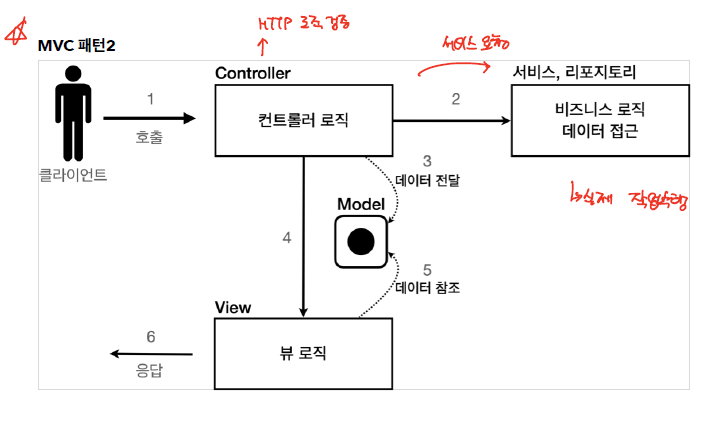

# Design Pattern

## Iterator Pattern
Iterator을 이용해서 서로 다른 컬렉션에 접근하는 디자인 패텅방식이다.

집합체(Aggregate)에 대해서 반복자(Iterator)을 구현함으로써 객체 접근 방식을 Iterator로 통일할 수 있고, 구현체에 직접적으로 의존하지 않기 때문에 변경의 요지를 최소화 할 수 있다.

> Class

```java
public class Book {
    private String name;

    public Book(String name) {
          this.name = name;
    }

    public String getName() {
        return name;
    }
}
```

> Aggregate 

```java
public interface Aggregate {
    public abstract Iterator createIterator();
}
```

> BookShelf -> Concrete Aggregate for Book

```java
public class BookShelf implements Aggregate {
    private Book[] books; // 책의 집합
    private int last = 0; // 마지막 책이 꽂힌 위치

    public BookShelf(int size) {
        books = new Book[size];
    }

    public Book getBook(int index) {
        return books[index];
    }

    public int getLength() {
        return last;
    }

    // 책꽂이에 책을 꽂는다
    public void appendBook(Book book) {
        if (last < books.length) {
            this.books[last] = book;
            last++;
        } else {
            System.out.println("책꽂이가 꽉 찼습니다!");
        }
    }

    @Override
    public Iterator createIterator() {
        return new BookShelfIterator(this);
    }
}
```

> Bookshelf Iterator

```java
public class BookShelfIterator implements Iterator<Book> {
    private BookShelf bookShelf; // 검색을 수행할 책꽂이
    private int index = 0; // 현재 처리할 책의 위치

    public BookShelfIterator(BookShelf bookShelf) {
        this.bookShelf = bookShelf;
    }

    @Override
    public boolean hasNext() {
        return index < bookShelf.getLength();
    }

    @Override
    public Book next() {
        Book book = bookShelf.getBook(index);
        index++;
        return book;
    }
}
```

```java
public class Main {
    public static void main(String[] args) {
        BookShelf bookShelf = new BookShelf(10);

        Book book1 = new Book("Bilbe");
        Book book2 = new Book("Cinderella");
        Book book3 = new Book("Daddy-Long-Legs");

        bookShelf.appendBook(book1);
        bookShelf.appendBook(book2);
        bookShelf.appendBook(book3);

        System.out.println("현재 꽂혀있는 책 : " + bookShelf.getLength() + "권");

        //Iterator와 Aggreate를 이용해서 collection에 대한 접근 방식을 통일할 수 있다.
        Iterator it = bookShelf.createIterator();
        while (it.hasNext()) {
            Book book = (Book) it.next();
            System.out.println(book.getName());
        }
    }
}
```

## MVC Pattern



mvc pattern은 이전에도 다뤘듯이 위와 같은 방식으로 구조로 동작한다.

> Controller

Http Request을 받아서, query parameter을 분석한 다음, 적절 Service 를 호출해서 작업을 수행하고, 수행 결과물을 Model에 담는다.

> View

Model에서 데이터를 뽑아와서 해당 데이터를 화면에 출력하는 역할을 수행한다.

> Model

Controller 와 View 사이에서 데이터를 옮기기 위한 매개체로 동작하며, Controller는 비즈니스 로직만 신경쓸 수 있게, 뷰는 화면 출력만 수행할 수 있도록 역할을 분리시켜준다.

여기서 Model은 request 객체의 getAttribute/setAttribute을 통해서 사용하겠다.

### 회원 등록 폼

#### Controller
이전에는 회원 등록폼 jsp가 바로 출력하도록 하였는데, 이제는 모든 http request를 controller가 처리할 수 있도록 하고, 해당 form 또한 controller가 호출할 수 있도록 한다.

```java
@WebServlet(name="mvcMemberFormServlet",urlPatterns = "/servlet-mvc/members/new-form")
public class MvcMemberFormServlet  extends HttpServlet {
    @Override
    protected void service(HttpServletRequest request, HttpServletResponse response) throws ServletException, IOException {
        String viewPath="/WEB-INF/views/new-form.jsp";
        RequestDispatcher requestDispatcher = request.getRequestDispatcher(viewPath);
        requestDispatcher.forward(request,response);
    }
}
```

/servlet-mvc/members/new-form로 접속하게 되면 controller는 /WEB-INF/views/new-form.jsp 파일을 사용자에게 출력하게 된다.


```java
String viewPath="/WEB-INF/views/new-form.jsp";
RequestDispatcher requestDispatcher = request.getRequestDispatcher(viewPath);
requestDispatcher.forward(request,response);
```

controller 동작과정에 있어, forward 메소드를 이용하게 된다.
forward 메소들 사용하게 되면, redirect 방식과 같이 새로운 경로로 새로운 요청을 수행하는 것이 아니라, 서버 내부에서 해당 경로를 자동으로 호출해주는 것이다. 그렇게 되면 url이 바뀌는 redirect 방식과 달리 forward는 url이 바뀌지 않는다.

url는 그대로 /servlet-mvc/members/new-form 이고, 화면만 WEB-INF/views/new-form.jsp이 출력되는 것이다.

*/WEB-INF 아래에 있는 파일에 대해서는 직접 접근이 안되며, 오직 controller을 통한 JSP 호출 방식으로 접근이 가능하다.*

#### View

```jsp
<%@ page contentType="text/html;charset=UTF-8" language="java" %>
    <html>
        <head>
            <title>Title</title>
        </head>
        <body>
        <form action="save" method="post">
            username: <input type="text" name="username" />
            age: <input type="text" name="age" />
            <button type="submit">전송</button>
        </form>
    </body>
</html>
```
회원 등록 html form 기존과 유사하다. 다만, form action 부분의 save가 상대 경로임을 주의하자. form 이 /servlet-mvc/members/save로 전송되게 된다.

### 회원 저장

#### Controller

> Member Join

```java
String username = request.getParameter("username");
int age = Integer.parseInt(request.getParameter("age"));

Member newMember=new Member();
newMember.setUsername(username);
newMember.setAge(age);

memberRepository.save(newMember);     
```

> Put data in model

```java
//Model에 데이터 보관
request.setAttribute("member",newMember);

//View로 이동동
String viewPath = "/WEB-INF/views/save-result.jsp";
RequestDispatcher dispatcher = request.getRequestDispatcher(viewPath);
dispatcher.forward(request, response);
```

다음과 같이 setAttribute을 이용해서 Member 객체를 저장한다.

#### View

```jsp
<%@ page contentType="text/html;charset=UTF-8" language="java" %>
    <html>
        <head>
            <title>Title</title>
        </head>
        <body>
        성공
        <ul>
            <li>id=${member.id}</li>
            <li>username=${member.username}</li>
            <li>age=${member.age}</li>
        </ul>
        <a href="/index.html">메인</a>
        </body>
    </html>
```
setAttribute에 저장한 모델에 대해 jsp에서는 ${파라미터명.필드} 방식으로 객체에 접근할 수 있도록 지원한다.

### 회원 목록 조회

#### Controller

> Member Join

```java
List<Member> members=memberRepository.findAll();
```

> Put data in model

```java
//Model에 데이터 보관
request.setAttribute("members",members);

//View로 이동동
String viewPath = "/WEB-INF/views/members.jsp";
RequestDispatcher dispatcher = request.getRequestDispatcher(viewPath);
dispatcher.forward(request, response);
```

#### View

```jsp
<%@ page contentType="text/html;charset=UTF-8" language="java" %>
<%@ taglib prefix="c" uri="http://java.sun.com/jsp/jstl/core"%>
<html>
    <head>
        <meta charset="UTF-8">
        <title>Title</title>
    </head>
    <body>
        <a href="/index.html">메인</a>
    <table>
        <thead>
            <th>id</th>
            <th>username</th>
            <th>age</th>
        </thead>
        <tbody>
            <c:forEach var="item" items="${members}">
                <tr>
                    <td>${item.id}</td>
                    <td>${item.username}</td>
                    <td>${item.age}</td>
                </tr>
            </c:forEach>
        </tbody>
    </table>
    </body>
</html>
```
```html
<c:forEach var="item" items="${members}">
                <tr>
                    <td>${item.id}</td>
                    <td>${item.username}</td>
                    <td>${item.age}</td>
                </tr>
</c:forEach>
```

c 태그를 활용해서 리스트 형태의 변수에 대해 반복 처리를 쉽게 할 수 있다.

c 태그를 사용하기 위해 아래의 선언문을 추가해줘야한다.
```jsp
<%@ taglib prefix="c" uri="http://java.sun.com/jsp/jstl/core"%>
```


## References

### Book
[면접을 위한 CS 전공지식 노트](http://www.yes24.com/product/goods/108887922)


