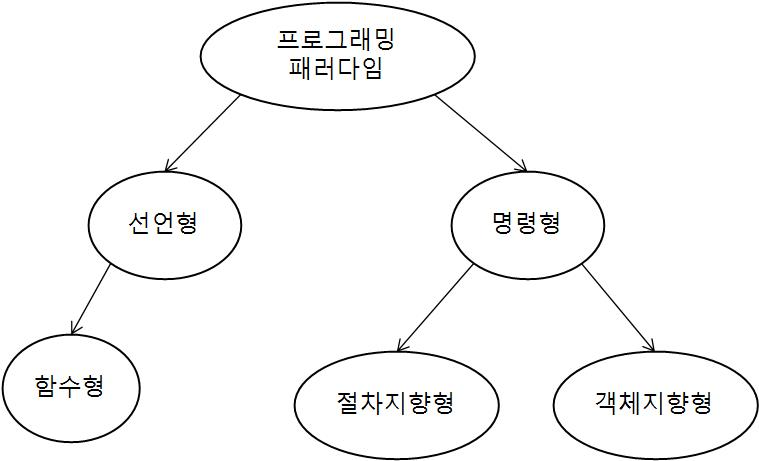

# Programming Paradigm

프로그래밍은 아래와 같은 방식으로 분류된다.



## 선언형과 함수형

선언형 프로그래밍은 '무엇'에 집중하는방식의 프로그래밍으로 일반적인 C, Java와 같은 명령형 프로그래밍과 달리 알고리즘을 요하지 않고 원하는 바를 표현하는 것이다.

대표적으로 SQL,HTML 이 선언형 언어라고 할 수 있다.

```sql
SELECT NAME, AGE
FROM MEMBER
```

아래의 코드는 특정 리스트의 원소를 모두 2만큼 키워주는 코드이다. 
아래의 코드는 어떤 식으로 원소의 값을 키우는 지에 대한 알고리즘에 집중하는 명령형 언어의 표현방식이다.

```java
public static ArrayList<Integer> adder(ArrayList<Integer> arr) {
        ArrayList<Integer> newList = new ArrayList<>();

        for (Integer value : arr) {
            newList.add(value + 2);
        }
        return newList;
    }
```

하지만 이를 아래와 같이 선언형 방식으로 표현이 가능하다. 선언형 프로그래밍의 핵심은 어떻게 동작하는 지에 대한 과정을 추상화 시킴으로써 실제 구현을 모르게 하는 것이다.

```java
public static void adder(ArrayList<Integer> arr) {
        arr.stream().map((item) -> (item + 2));
    }
```

## 객체지향형

OOP(Object Oriented Programming)은 프로그램을 객체의 집합으로 이루어져 객체들간의 상호작용을 표현하는 방식이다. 객체는 속성(property) 와 메소드(operation)으로 이루어져 있다.

### 객체의 특징

#### 추상화

공통된 성질을 추출하여 핵심적인 개념, 기능을 간추려내는 것을 의미하며, 이를 통해 하나의 공통된 추상 클래스로 정의할 수 있다.

예를 들어, 자동차, 지게차와 같이 2개의 객체가 있을 때, 이 둘은 움직이다 와는 같은 기능으로 추상화를 시킬 수 있다.

추상화를 적용하는 방식은 interface를 활용하는 방법과 추상클래스를 이용하는 방식이다.

> 인터페이스

```java
interface Moveable{
    void move();
}

class Car implements Moveable{
    ...
    @Override
    void move(){
        System.out.println("Car Moving");
    }
}

class SuperCar implements Moveable{
    ...
    @Override
    void move(){
        System.out.println("SuperCar Moving");
    }
}
```

> 추상 클래스

```java
public abstract class Moveable{
    public void info(){
        System.out.println("This is a moveable object");
    }
    public abstract move();
}

class Car extends Moveable{
    ...
    @Override
    void move(){
        System.out.println("Car Moving");
    }
}

class SuperCar extends Moveable{
    ...
    @Override
    void move(){
        System.out.println("SuperCar Moving");
    }
}

```

> 다형성

하나의 메소드가 다양한 방식으로 동작되는 것을 의미한다. 가령 상속관계에 있는 클래스에 대해서, 하위 클래는 상위 클래스의 메소드를 오버라이딩해서 하위 클래스에 맞게 구현하게 된다. 이때 상위 클래스의 메소드를 호출하게 되면 각각의 하위클래스에 대해서는 서로 다르게 동작을 하게 되는 것이다. 

```java
class Animal {
    public void bark() {
        System.out.println("mumu! mumu!");
    }
}

class Dog extends Animal {
    @Override
    public void bark() {
        System.out.println("wal!!! wal!!!");
    }
}

class Cat extends Animal {
    @Override
    public void bark() {
        System.out.println("Meow Meow");
    }
}

public class Main {
    public static void main(String[] args) {
        Animal[] animals=new Animal[2];
        animals[0]=new Dog();
        animals[1]=new Cat();

        for(Animala animal: animals){
            animal.bark();
        }
    }
}
```

> 캡슐화

객체의 속성, 메소드를 하나의 클래스 형태로 묶어서 외부에 해당 구체 내용을 감추어서 불필요한 정보의 노출을 막을 수 있다. 또한 구체적인 내용을 알필요 없이 해당 클래스의 사용으로 원하는 기능의 효과를 얻을 수 있다.

```java
class SinivelCap {    //콧물 처치용 캡슐
    void take() {
        System.out.println("콧물 제거 완료");
    }
}

class SneezeCap {    // 재채기 처치용 캡슐
    void take() {
        System.out.println("재채기 처치 완료");
    }
}

class SnuffleCap {    //코막힘 방지용 캡슐
    void take() {
        System.out.println("코막힘 처치 완료");
    }
}

public static void main(String[] args){
    SnivelCap snivel=new SnivelCap();
    SneezeCap sneeze=new SneezeCap();
    SnuffleCap snuffle=new SnuffleCap();

    //복용 순서 1
    snivel.take();
    sneeze.take();
    snuffle.take();

    //복용 순서 2
    sneeze.take();
    snivel.take();
    snuffle.take();
}
```
위의 경우 각각의 캡슐을 정의한 클래스가 있고, 이를 take() 메소드의 호출을 이용해서 약을 복용하는 과정을 보여주고 있다.

이와 같이 모든 클래스를 단독적으로 분리해서 사용하게 될 경우 구체적인 클래스를 모두 알아야 되고, 약의 복용순서가 있는 경우 사용자는 복용순서를 명확히 알고 그에 따른 순차적인 메소드 호출이 필요하다 하지만 아래와 같이 캡슐화를 이용해서 하나의 클래스로 묶어주면 코드가 간결해지고, 사용자의 편의성을 추구할 수 있다.

```java
class SinivelCap {    //콧물 처치용 캡슐
    void take() {
        System.out.println("콧물 제거 완료");
    }
}

class SneezeCap {    // 재채기 처치용 캡슐
    void take() {
        System.out.println("재채기 처치 완료");
    }
}

class SnuffleCap {    //코막힘 방지용 캡슐
    void take() {
        System.out.println("코막힘 처치 완료");
    }
}

Class Capsule1{
    SnivelCap snivel=new SnivelCap();
    SneezeCap sneeze=new SneezeCap();
    SnuffleCap snuffle=new SnuffleCap();

    public void take(){
        snivel.take();
        sneeze.take();
        snuffle.take();
    }
}

Class Capsule2{
    SnivelCap snivel=new SnivelCap();
    SneezeCap sneeze=new SneezeCap();
    SnuffleCap snuffle=new SnuffleCap();

    public void take(){
        sneeze.take();
        snivel.take();
        snuffle.take();
    }
}

public static void main(String[] args){
    Capsule1 capsule1=new Capsule1();
    Capsuel2 capsule2=new Capsule2();

    //복용 순서 1
    capsule1.take();

    //복용 순서 2
    capsule2.take();
}
```

> 상속

연관된 클래스에 대해 일련의 공통 규약을 정의하는 것이 바로 상속이다. 상위 클래스를 이용해서 공통적인 특성을 묶고, 하위 클래스를 이용해서 구체화 시키는 방식으로 재사용성, 유지보수성 측면에서 매우 중요한 부분이다.

```java
class Man{
    String name;

    public void introduce(){
        System.out.println("My name is " + name);
    }
}

class BusinessMan extends Man{
    String company;

    @Override
    public void introduce(){
        super().introduce();
        System.out.println("I'm working on " + company);
    }
}

class Student extends Man{
    String university;

    @Override
    public void introduce(){
        super().introduce();
        System.out.println("I'm studying on " + university);
    }
}
```


### SOLID 원칙

#### SRP: 단일 책임 원칙(Single Responsiblity Principle)
하나의 클래스는 하나의 책임만을 가져야한다. 클래스 하나하는 최소한의 기능 수행을 목적으로 설계를 진행해야 변경을 하더라도 추가적으로 변경해야되는 소지가 적어진다.

```java
class Car{
    public void start(){}
    public void move(){}
    public void stop(){}
    public int getOilGauge(){} 
    public void washCar(){}
    public void changeTire(){}
}
```
이런식으로 Car 클래스가 있다고 가정한다면, 실제 운전자의 경우 start,move,stop,getOilGauge 기능을 사용하고, 세차장 직원은 washCar, 정비공은 changeTire 기능을 이용하게 된다.

만약 여기서 운전자가 수행하는 기능에 수정이 일어나게 되면, 나머지 역할을 담당하는 부분에서도 코드 수정이 동반된다. 이는 SRP에 어긋난 개발방식이다.

```java
class moveCar{
    public void start(){}
    public void move(){}
    public void stop(){}
    public int getOilGauge(){}
}
class washCar{
    public void washCar(){}
}
class repairCar{
    public void changeTire()(){}
}
```
이런식으로 책임단위를 최소화해야 변경 간에 코드 수정요소가 적다.

#### OCP: 개방-폐쇄 원칙(Open Close Principle)
개방-폐쇄의 원칙은 확장에는 열려있고, 수정은 닫혀있는 것을 의미한다. 기능 확장에는 제한이 없지만 그렇다고 변경을 해서는 안된다는 말이다.

```java
class MemberRepository{
    public void accessMemory(){}
    public void accessmySQL(){}
}
```

아래와 같은 클래스가 있다고 가정하자. 내가 만약 데이터 저장을 메모리에 하고자 한다면 MemoryRepository의 accessMemory 메소드를 이용하면 되지만, MySQL에 저장하고자 하면 accessmySQL 메소드를 이용하면 된다. 

하지만 만약 여기서 내가 MongoDB에 데이터를 저장하고자 한다면 어떻게 해야할까? MemberRepository에 accessMongoDB라는 메소드를 추가해줘야한다. 이처럼 기능을 확장하기 위해서 클래스를 수정하게 되면 OCP 원칙에 어긋난다.

```java
interface MemberRepository{
    public void access(){}
}
class MemoryMemberRepository implements MemberRepository{
    public void access(){}
}
class MySQLMemberRepository implements MemberRepository{
    public void access(){}
}
```

이렇게 interface와 class를 분할해서 구현하게 되면 나중에 새로운 방식의 저장매체를 이용한다 하더라고 클래스만 추가시켜주면 된다.

#### LSP: 리스코프 치환 원칙(Liskov Substitution Principle)
리스코프 치환 원칙은 부모 클래스와 자식클래스가 간에 언제 상호 변경이 가능해야한다는 것을 의미한다. 그렇게 하기 위해서는 자식 클래슨 항상 부모 클래스가 의도한 대로 동작해야한다.

```java
public class Rectangle {
    private int width, height;

    public void setWidth(int width) {
        this.width=width;
    }
    public void setHeight(int height) {
        this.height=height;
    }
    public int getArea() {
        return width * height;
    }
}

public class Square extends Rectangle {
    public Square(int size) {
        super(size, size);
    }
    public void setWidth(int width) {
        super.setWidth(width);
        super.setHeight(width);
    }
    public void setHeight(int height) {
        super.setWidth(height);
        super.setHeight(height);
    }
    public int getArea() {
        super.getArea();
    }
}

```
위와 같이 Rectangle, Square 클래스가 있다고 가정하자

이럴때, Rectangle의 길이를 수정하는 함수를 만든다고 가정하자

```java
Rectangle rectangle = new Rectangle();
rectangle.setWidth(3);
rectangle.setHeight(5);
rectangle.getArea(); //==> 15

Rectangle rectangle = new Square();
rectangle.setWidth(3);
rectangle.setHeight(5);
rectangle.getArea(); // ==>25
```
아래와 같이 함수를 실행하게 되면 에러가 발생하게 된다. Rectangle class에서는 너비와 높이가 다르다는 가정 하에 동작을 진행하지만, Square는 높이와 너비가 같기 때문에 에러가 발생하게 된다. 
```java
interface Shape {
  int getArea():
}
public class Rectangle implements Shape {
    private int width, height;

    public void setWidth(int width) {
        this.width=width;
    }
    public void setHeight(int height) {
        this.height=height;
    }
    public int getArea() {
        return width * height;
    }
}

public class Square implements Shape {
    public Square(int size) {
        super(size, size);
    }
    public void setWidth(int width) {
        super.setWidth(width);
        super.setHeight(width);
    }
    public void setHeight(int height) {
        super.setWidth(height);
        super.setHeight(height);
    }
    public int getArea() {
        super.getArea();
    }
}
```
LSP를 지켜주기 위해 부모 클래스와 자식 클래스의 성질이 다른 경우 interface를 활용해서 관리한다.

#### ISP: 인터페이스 분리 원칙(Interface Segregation Principle)
인터페이스 분리의 원칙은 인터페이스의 기능 단위를 최소화하라는 의미한다. 예를 들어 아래와 같은 interface가 있다고 하자.
```java
interface move{
    public void drive();
    public void fly();
}

public class Car implements move{
    public void drive(){};
    //public void fly(){};
}

public class Airplane implements move{
    public void drive(){};
    public void fly(){};
}
```
interface를 move와 같이 만들게 되면 fly() 동작이 필요없는 car class에서도 fly()를 구현해야되고 이를 해결하기 위해 interface의 기능 단위를 최소화해준다.

```java
interface move{
    public void drive();
}

interface fly {
    public void fly();
}

public class Car implements move{
    public void drive(){};
}

public class Airplane implements move,fly{
    public void drive(){};
    public void fly(){};
}
```
#### DIC: 의존관계 역전 원칙(Dependency Inversion Principle
의존관계 역전 원칙은 추상화에 의존해서 객체를 참조해야함을 의미한다.
```java
class K3 {
    public void drive(){}
}
class Santafe {  
  public void drive(){}
    	
}
class CarController {
  public void drive(model,drive) {
    	if(model=="K3")
        	K3.drive();
        else if(model=="Santafe")
        	Santafe.drive();
  }
}
```
위와 같이 직접적으로 구현 클래스에 접근해서 메소드를 호출하는 방식으로 설계하면, 나중에 새로운 구현 클래스를 생성하게 되면 Controller 클래스의 분기문을 수정해줘야한다.

```java
public interface DriveController {
    public void drive(){}
}
class K3 implements DriveController {
    public void drive(){}
}
class Santafe implements DriveController{  
  public void drive(){}
    	
}

class CarController {
    private DriveController driveController

    public CarController(Model model){
        driveController=model
    }
    public void drive() {
    	driveController.drive()
  }
}
```


## 절차 지향형

절차지향형 프로그래밍의 경우 연속적인 계산으로 이루어져 있어, 순차적으로 코드가 이어져있다. 특정 로직이 실행되는 방식으로 코드가 순서대로 되어있기 때문에 가독성이 뛰어나다.

```C
int main(void){
    int arr[3]={1,2,3};
    int sum=0;
    for(int i=0;i<3;i++){
        sum+=arr[i];
    }
    printf("sum: %d\n",&sum);
}
```

## 결론

어떠한 프로그래밍 방식이 가장 좋은가? --> 해당 질문에 대한 대답은 없다. 비즈니스 로직, 서비스의 특징을 고려하여 상황에 맞는 패러다임을 선택하는 것이 중요하다. 경우에 따라서는 두가지 이상의 패러다임을 혼합하는 방식의 프로그래밍을 하는 경우도 있다.


## References

### Book
[면접을 위한 CS 전공지식 노트](http://www.yes24.com/product/goods/108887922)


