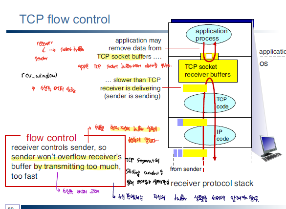
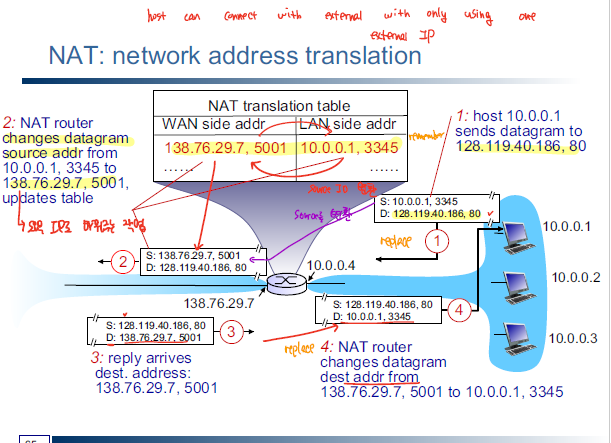
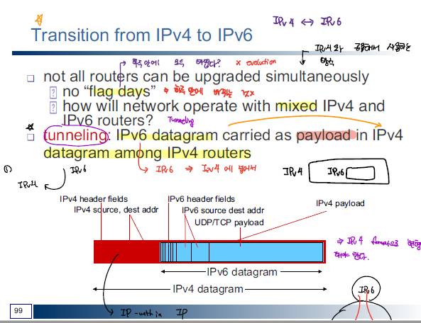

# Network

## Basic

네트워크라고 하는 것은 흔히 Graph 자료구조와 동일한 구조로 이해해볼 수 있는데, 노드와 링크를 가지고 있다. 여기서 노드는 허브,스위치, 라우터와 같은 네트워크 장비를 의미하며 링크는 유선, 무선 연결 방식을 의미한다.

각종 용어
|Terms|Descriptions|
|--|--|
|Throughput|단위 시간동안 처리되는 데이터의 양 주로 bps(bit per second) 단위를 사용한다.|
|Latency|링크를 통해 두 장치 간 왕복 이동 시간을 의미한다. latency가 높다는 의미는 그 만큼 데이터가 이동하는 데 시간이 많이 걸린다는 의미이다.

## Network Topoloy

Topology라고 하는 것은 위상을 뜻하며, 이는 노드와 링크가 어떠한 구조로 배치되어 있는지를 의미한다.

> Tree Topology


tree 형태로 각각의 node들이 계층 구조를 이루고 있으며 노드가 추가됨에 따라 하위 노드에 영향이 갈 수 있다.

> Bus Topology


공용 회선 하나를 이용해서 여러 개의 node가 네트워크를 공유하고 있는 구조이며, LAN을 구성할 때 주로 사용하는 방식이다.

> Star Topology


중앙에 스위치와 같은 네트워크 장비를 설치해서 node 간의 통신을 중아에서 제어하는 방식이다. 스위치에서 각각의 노드에 대한 통신을 관장하기 때문에 네트워크 충돌 문제를 방지할 수 있지만, 중앙에 위치한 노드에 장애가 발생할 경우 모든 노드간의 통신이 중단된다.

> Ring Topology


하나의 긴 환 처럼 연결되어 있는 구조로 Token Passing과 같은 통신 방식을 활용하여 네트워크 충돌을 방지할 수 있다.하지만 모든 회선이 연결되어 있기 때문에 하나의 노드에서 장애가 발생할 경우 모든 노드가 동작하지 않는다.

> Mesh Topology


모든 노드 간에 link가 연결되어 있고, 하나의 링크가 손상되어도 다른 링크가 존재하기 때문에 결함에 강한 특징이 있으나, 많은 link 수가 요구되여 구축 비용 및 운용비용이 크다

## LAN,MAN,WAN

네트워크는 규모에 따라 크게 3개로 분류할 수 있는데,
우선, LAN은 Local Area Network로 한정된 지역내에서의 네트워크를 구성하는 것이다. 보통 한 사무실이나, 건물 내에서의 네트워크 규모의 구성을 의미한다.

MAN은 Metropolitan Area Network으로 대도시급의 네트워크를 구성하는 것이다. 

WAN은 Wide Area Network으로 광역 네트워크를 의미하며 가장 광범위한 영역의 네트워크를 구성하는 것이고, 그에 따른 네트워크 혼잡도가 가장 크다.


## Network Protocol


네트워큰 위의 그림에서 보면 알듯이 ISO에서 정의한 네트워크 프로토콜에 관련된 규악으로 네트워크를 7개의 계층으로 분리하여 각 계층간의 상호작용을 통해 데이터 통시닝 이루어지도록 한다.

### Application Layer

OSI 계층에서 최상위 계층에 존재하는 응용 계층은 네트워크 서비스와 관려된 프로토콜을 처리한다. 가령, 메일과 관련된 SMTP, 파일 전송의 FTP, Domain-IP 간 주소변환을 처리한 DNS의 같은 어플리케이션이 있다.

end-system에서 동작하는 프로세스에 대해서, 각각의 end-system간 통신 방식에 따라 server-client 방식와 peer-to-peer 방식으로 나눌 수 있다.


client-server 방식의 경우 client은 server을 통해 다른 client과 통신을 진행할 수 있다. 


p2p의 경우 client 간의 통신 과정에 있어 server의 매개가 필요없고 client 간에 다이렉트으로 연결되어 통신을 수행하게 된다. 중앙 서버가 따로 업서 서버 변조로 인한 공격에 대비가 가능한 장점이 있다. 하지만 IP가 다른 클라이언트에 노출된다는 점에서 보안성이 뛰어나다고 하기는 어렵다.

### Presentation Layer, Session Layer

Presentation Layer(표현 계층)은 응용계층에서 받은 데이터에 대한 인코딩, 디코딩, 압축 과정을 처리하는 계층이다.

Session Layer은 통신을 수행하는 node간에 논리적인 연결인 세션을 관리하여 전이중/반이중 여부를 결정하는 등 호스트 간에 연결을 담당하는 계층이다.

### Transport Layer

전송 계층은 서로 다른 host에서 실행되는 프로세스 간의 통신을 처리하는 계층이다. Transport ayer에서는 application layer에서 넘어온 데이터를 segment 단위로 나눠서 Internet Layer로 넘겨주게 된다.

Transport Layer은 크게 TCP, UDP 방식으로 나눠진다.

TCP segment의 경우 아래와 같은 구조로 이루어져 있으며 신뢰성 있는 데이터의 전송을 보장하기 위해 사용된다.


TCP는 SEQ, ACK를 이용해서 IP 계층에서 전달되는 패킷 간의 순서가 올바른 지 판단을 하여 전송되는 패킷의 순서를 보장하게 된다.

반면 UDP는 아래와 같이 매우 간단한 구조로 이루어져 있으며, TCP와 달리 신뢰성 있는 패킷의 전송을 보장하지 않고, Checksum을 통한 체크 만을 수행한다. 주로 UDP는 media 전송과 같이 미세한 오류를 허용하면서 속도를 보장해야되는 어플리케이션에 많이 사용된다.


TCP는 위에서 언급한 순서 보장이외에도 흐름 제어, 혼잡 제어와 같은 다양한 신뢰성 기반의 기능을 제공하는데 이에 대해 하나씩 살펴 보자

우선, TCP는 신뢰성 있는 데이터 송수신을 위해 노드 간에 연결이 동반된다.

> 3-way Handshaking


TCP는 위와 같이 3-way handshaking 방식을 이용해서 서로 간의 연결을 진행한다. 이때, SEQ, ACK를 정보를 이용해서 전달되는 데이터가 올바른 지 판단을 하게 된다. 

3-way handshaking 과정을 통해 initial seq#, buffer size와 같은 각종 parameter을 처리한다. 

TCP 연결이 있으니, TCP 연결 종료 과정도 요구된다.

> 4-way Handshaking

TCP는 연결을 종료하고자 할때, 4-way handshaking 방식을 통해 각자 FIN을 보내서 연결을 종료한다.


위의 과정을 보면 server 쪽에서 FIN을 보낸 이후에 client가 TIME_WAIT 상태로 들어가는 것을 확인할 수 있는데, client 측에서 바로 종료되지 않고 TIME_WAIT을 하는 이유가 멀까?

이는, client 측에서 server 측의 FIN에 대한 ACK를 보낼 때, 해당 ACK가 누락되는 경우 server는 다시 FIN을 보내야 하는데 만약 이미 client가 종료된 상태라고 하면 FIN 요청을 다시 받을 수 없게 된다. 따라서 client 측은 ACK이 누락되는 경우를 대비해서 RTT 정도의 시간을 추가로 기다리게 된다.

> flow control

TCP를 이용해서 데이터를 전송하게 되면 수신측의 buffer size을 고려해서 segment을 보내게 된다. 무작정 보내는 것이 아니라 여유 있는 buffer size를 파악해서 데이터를 보낸다. TCP header에 보면 window size항목이 있는데, window size을 이용해서 여유 있는 buffer의 크기를 저장하게 된다.




> packer order checking


TCP protocol에서는 SEQ와 수신측에서 ACK를 분석해서 packet의 순서를 맞춘다.
만일 packet이 누락되거나, 순서에 맞지 않는 packet을 요청 받았을 때는 Retransmission을 진행한다.

> congestion control

또한, TCP는 네트워크에서 너무 많은 양의 데이터가 처리되는 것을 예방한다. 하나의 공용회선에 많은 양의 데이터가 전송되게 되면 네트워크 혼잡도 커지게 되고 그에 따라 데이터 누락이 되는 문제가 발생할 수 있다. 


네트워크 내에 segment가 threshold에 도달하기 전까지는 지수 증가의 slow start 과정을 수행하고 threshold을 넘어설 경우 선형 증가의 congestion avoidance 과정을 거친다. 계속해서 window size을 늘리면서 전송되는 segment의 양을 늘려가는데 이때 timeout 혹은 duplicated ACK가 발생하는 경우 window size을 1 MSS으로 줄이고 threshold 또한 반으로 절감해서 다시 slow start 과정 부터 다시 진행한다.

congestion control 방식에 따라서, duplicated ACK에 대한 처리를 timeout 처리와 구분해서 진행하기도 하는데, duplicated ACK의 경우 혼잡도 timeout 보다는 높지 않기 때문에 window size를 1MSS 대신에 duplicated ACK가 발생한 시점의 window size의 반으로 하는 fast recovery 과정을 수행하는 방안도 있다.

### Internet Layer

특정 라우터로부터 다른 라우터 까지의 경로를 찾는 라우팅을 통해 최적의 경로로 패킷을 전송하게 된다. IP header에 설정된 Source IP, Destination IP을 이용해서 데이터 송수신이 이루어지며 패킷 전송 후에는 패킷이 제대로 전송되었는지에 대한 점검은 따로 진행하지 않는다. 따라서 패킷이 누락되거나 패킷의 순서가 맞지 않는 경우가 발생하기도 한다.

Internet Header의 구조는 아래와 같다.


> Connection Type


> Ip Address

IP는 32bit 크기로 네트워크 상에서 host에 대한 고유 주소 정보이다. 네트워크에서 host 간에 연결에 있어 IP 정보를 이용해서 서로를 식별한다. 이러한 IP는 맨앞자리 숫자에 따라 A,B,C,D,E 클래스로 구분하게 된다.


IP 주소는 Network 와 Host 주소로 나눠지게 되는데, Host 주소는 같은 네트워크 내에서 Host을 구분하기 위해 사용된다. 가령, B 클래스 1개의 IP에 대해서는 최대 256*256개의 host를 할당할 수 있다. 하지만 이는 매우 많은 양의 host을 의미하는데, 이렇게 host을 많이 구성할 필요가 없는 네트워크 환경에서는 그 만큼 ip 주소가 낭비되는데, 이러한 IP 주소의 낭비를 막기 위해 Subnet 개념이 필요하다.

하나의 큰 네트워크를 아래와 같이 여러 작은 subnet 단위로 분할해서 사용하여 효율적인 host address 할당이 가능하다. 


위와 같이 subnet을 할당하게 되면 class 할당 방식의 ip으로는 ip 주소를 표현할 수 없고 class-less 방식을 이용해야한다. 즉, subnet mask을 이용해서 subnet network address와 host address을 얻어 낼 수 있다. 


> Fragmentation And Reassembly

네트워크 link에서 데이터를 전송할 수 있는 최대 크기는 한정되어 있다. 따라서, IP 계층에서는 하나의 큰 데이터에 대해 여러 작은 조각으로 잘라서 이를 패킷으로 만들어서 각각 독립적으로 전달한 다음 다시 목적지 노드에 도달했을 때 다시 하나의 조각으로 모으는 작업을 수행한다.


IP header의 identifier 과 fragmentation offset을 이용해서 fragmentation, reassembly 과정을 진행한다.

> DHCP

IP 주소도 하나의 제한된 자원으로 무작정 할당하게 되면 IP 주소가 부족해지는 문제가 발생한다. 그렇기 때문에 효율적으로 ip 주소를 할당하도록 해야하는데, 이를 위해 DHCP와 NAT를 주로 사용한다.

DHCP는 Dynamic Host Configuration Protocol로 네트워크에 접속했을 때 자동으로 IP를 할당받는 방식이다. 고정 IP와 달리 네트워크에 접속했을 때 IP를 할당받는 방식으로 DHCP서버에 의해 IP 주소가 관리된다. DHCP를 통해 가장 가까운 라우터 정보, 게이트워이 정보, 서브넷 정보, 등의 네트워크 관련 추가정보도 같이 전달받게 된다.


> NAT

Network Address Translation을 이용하면 여러 디바이스에 대해서 하나의 공인 IP(public address)를 통한 데이터 통신이 이루어지도록 한다. 아래의 그림처럼 여러 디바이스가 하나의 공인 IP를 이용해서 외부와 연결되는 것을 볼 수 있다. 이렇게 NAT를 이용하게 되면 내부의 private address에 대해서는 외부에 노출되지 않고 이러한 private address는 해당 네트워크에서만 유효한 주소이기 때문에 다른 네트워크에서 중복해서 사용해도 된다.



> IPv6

NAT, DHCP를 활용하게 되면 효율적인 IP 할당으로 많은 네트워크 디바이스에 IP를 부여할 수 있지만, 현재는 수많은 네트워크가 기기가 존재하기 때문에 IPv4에서 할당 가능한 IP 주소로는 한계가 있다. 

이러한 IP 주소 고갈 해결하기 위해 IPv6가 등장하였다.


IP 주소를 128 bit으로 표현하여 거의 무한 개의 IP 주소를 할당할 수 있다. 또한 IPv6가 되면서 priority, flow label을 이용해서 Q.O.S를 제공하여 우선순위에 따른 데이터 처리를 신경썻다.

IPv4와 비교를 해보면 헤더 구조가 비교적 단순해진 것을 볼 수 있는데, 이를 통해 processing/forwarding 과정이 빨라졌다. IPv6는 헤더 구조를 단순화 대신에 다른 부가 기능을 extension header를 통해 제공한다.


IPv4와 달리 IPv6에서는 fragmentation은 하지 않도록 되어 있다(fragmentation header을 이용해서 source router에서 fragmentation되도록 할 수 있는 있다.) 또한 checksum 제거하여 router에서 header 처리 속도를 높이고자 하였다.

하지만 아직까지는 대부분 IPv4 주소 체계가 동작되는 상황에서 한번에 IPv6으로 변경할 수는 없다. 따라서 IPv4와 IPv6을 같이 사용할 수 있도록 해야하는 데 이를 위해 tunneling 과 double stack을 활용한다.

- Tunneling
    -  
    - IPv6을 IPv4 datagram 안에 포함해서 IPv4 router을 통해 데이터가 전송될 수 있도록 한다.
- Dual Stak
    - 
    - IPv4와 IPv6을 모두 처리할 수 있는 라우터를 활용하여 IPv4 < - > IPv6 간에 데이터 송수신이 가능하도록 한다.
    
#### Routing


IP 계층에서 수행하는 네트워크 기능의 대표적인 2가지는 forwarding 과 routing이다. forwarding은 router의 input에서 output 포트를 연결하는 기능이고 Routing은 Router 간에 네트워크 경로를 찾는 과정을 의미한다.

Forwarding은 Router 내부에서 동작하는 기능으로 Routing Table을 구성해서 Input Port에서 Outpurt port으로 패킷을 연결해주는 작업을 의미한다.HW의 영향을 많이 받는 기능이다. 그렇기 때문에 Routing이 더 중요한 요소하고 할 수 있다.

Routing 방식으로는 크게 2가지, Link-State, Distance Vector으로 구성된다.

> Link-State


전체 Routing Table을 모두 알고 있는 상태에서 진행되는 global하게 동작되는 알고리즘으로 Dijkstra 알고리즘을 기반으로 최적의 경로를 계산한다.

```python
for adj_vertex,cost in graph[vertex]:
    distance[adj_vertex]=min(distance[adj_vertex],distance[vertex]+cost)
```


Link-State 기반의 라우팅 방식을 취하는 protocol에는 RIP가 있다.

> Distance Vector


distance vector 방식은 모든 RT를 알고 있는 상태에서 진행되는 link-state 방식과는 달리 이웃한 router에 대해서 RT을 주고 받으면서 distance vector을 갱신하는 방식이다. 

```python
for vertex in range(1,n+1):
    for adj_vertex,weight in graph[vertex]:
        if distance[adj_vertex] > weight+ distance[vertex]:
              distance[adj_vertex] = weight+ distance[vertex]
```


Distance-Vector 기반의 라우팅 방식을 취하는 protocol에는 OSPF가 있다

> SDN

요즘에는 per-router 간의 라우팅 알고리즘이 아닌 SDN 방식의 centralized routing을 많이 활용한다. 실제 router 간의 동작으로 개별적으로 네트워크 경로를 구하는 방식이 아닌, 하나의 중앙 통제 장치를 통해 RT를 구성해서 전체 router에 배포하는 방식을 취한다. 이렇게 Computing Power을 집중시켜 효율적인 Routing 설계가 가능한 부분이 있고, Router 로부터 routing 기능을 제외시켜 Router는 Forwarding 기능에 집중하도록 한다.

### Link Layer Protocol

link layer은 인접한 노드 간에 링크를 구성해서 노드 단위 송수신이 가능하도록 하는 것이 link layer protocol이다.

물리 계층에서 넘어온 SDU를 받아서, ethernet frame을 구성해서 에러 확인, 흐름 제어, 접근 제어와 같은 기능을 제어한다.

> 에러 확인


Link Layer에서는 에러 확인을 위해 CRC bit을 trailor에 추가하는데, 이는 이더넷 프레임(바이트 구조)을 특정 generator G로 나눠서 발생하는 나머지를 CRC bit으로 추가해서 나중에 수신 측에서 CRC bit을 계산했을때 나눠떨어지는 지 여부를 판단하는 것이다.

> 다중 제어

공용 채널에서 여러 개의 노드가 동시에 데이터를 보내고자 하면 충돌이 발생하게 되는데 이때 충돌을 감지해서 충돌을 처리한 다음 데이터를 보내는 방식인 CSMA/CD 방식이 존재한다.


CSMA/CD란 Carrier Sensing Multiple Access/Collision Detection으로 데이터 전송을 하기에 앞서 우선 채널에 누가 데이터 전송을 진행하는지를 검사한 다음에 데이터를 보낸다.

만약 전송을 진행하는데, 충돌이 발생하면 그 즉시 중단을 멈추고 jamming signal을 전송해서 해당 채널에 충돌이 발생했음을 전파한다. 이후, binary exponential backoff을 통해 일정 시간을 기다리고 나서 다시 데이터 전송을 진행한다.


다만, 무선 연결 방식에서는 신호의 세기 약한 문제가 있어 RTT 체크를 수행하기 어려운 부분이고 있고, Hidden Station Problem 으로 인해 데이터를 전송 중인지 여부를 확인하지 못하는 경우가 있다. 그래서 무선 연결방식에서는 CSMA/CA를 통해 충돌을 회피하는 방향으로 접근한다.

데이터를 전송하고자 하는 측은 RTS(ReadyToSend을 보내서) 수신측에서 CTS(ClearToSend)을 받아 데이터를 전송하는 것을 의미한다. 이때 데이터 전송을 하지 않는 station에서는 NAV를 설정해서 해당 수신측에 데이터를 보내지 않도록 한다. 이후 NAV가 끝나게 되면 DIFS(일정 시간)을 기다려서 데이터를 전송하하는 작업을 진행한다.

> MAC 주소

Link layer에서는 인접한 노드간에 링크를 형성해서 데이터 송수신이 이루어진다. 이때 각 노드을 식별하기 위한 주소가 필요한데 이를 MAC 주소라고 한다. MAC 주소는 각 노드 마다 할당되는 고유 주소 link layer 계층에서의 통신을 위해 MAC 주소가 필수적으로 요구된다. 

하지만, 상대측 IP만 알고 있을 때, MAC주소를 어떻게 해서 알아낼까? 이럴 떄 ARP(Address Resolution Protocol)이 필요하다.


각각의 router arp query를 통해 ARP Table를 구성하여 연결되어 있는 노드에 대한 물리 주소 정보를 캐시하고 있다.


위의 그림을 통해 수신측 IP주소와 수신측 MAC 주소가 어떤식으로 변환되면서 데이터가 전송되는지 확인할 수 있다.

> Ethernet Frame

link layer에서 처리되는 PDU인 frame의 구조를 살펴보면 아래와 같다.


위에서 살펴보지 않은 것 중에, preemble은 송신측과 수신측간의 클록을 맞추기 위해 일련의 비트구조가 반복되어 있다. 

type는 어떠한 상위 계층인지를 명시하는 것으로, IP, ARP, 등으로 넘어갈 수 있다.

> Self- Learning

스위치에는 어떠한 포트에 어떠한 장비가 연결되어 있는지 저장하고 있다. 스위치에서는 port(interface)에 대한 장비 정보를 switch table 형태로 가지고 있어 특정 장비간의 데이터 통신을 중계한다.

switch table에 저장되어 있지 않은 장비에 대해 통신을 진행하려고 할때, flooding을 통해 모든 장비에 보내서, 맞는 장비가 포착이 되면 해당 장비에 대한 정보를 switch table을 구성하는 방식의 self-learning한다.

> VLAN

하나의 네트워크 장비(switch)을 이용해서 두 개 이상의 네트워크가 통신할 수 있도록 하고자 할 때 사용하는 방식이다. 즉, 하나의 switch에 2개 이상의 네트워크가 들어오는 의미이다.

가령, CS와 EE 부서가 있다고 했을때 CS 부서의 직원이 EE 부서로 파견 나와서 EE부서에서 일하게 되는데, 이때 망은 CS 부서망을 이용하고자 한다면 EE 부서 VLAN을 구성해서 CS 망이 들어올 수 있도록 하면 해당 직원은 위치는 이동했지만 동일한 망을 통해 작업을 이어 나갈 수 있게 된다.


또한, 트렁크 포트를 통해 스위치간에 VLAN이 이동할 수 있도록 할 수 있다.


vlan을 활용하고자 하면 기존의 ethernet frame에서 vlan을 구분할 수 있는 vlan identifier가 추가된 frame 구조를 사용해야한다.


## References

### Book
[면접을 위한 CS 전공지식 노트](http://www.yes24.com/product/goods/108887922)


