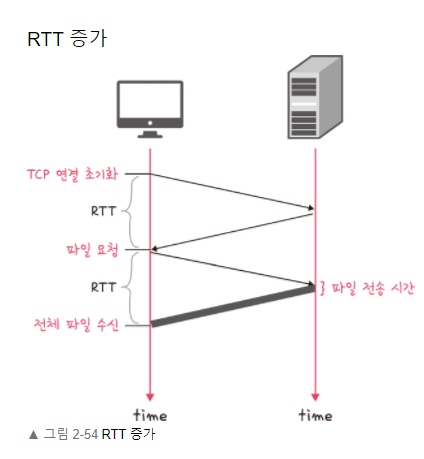
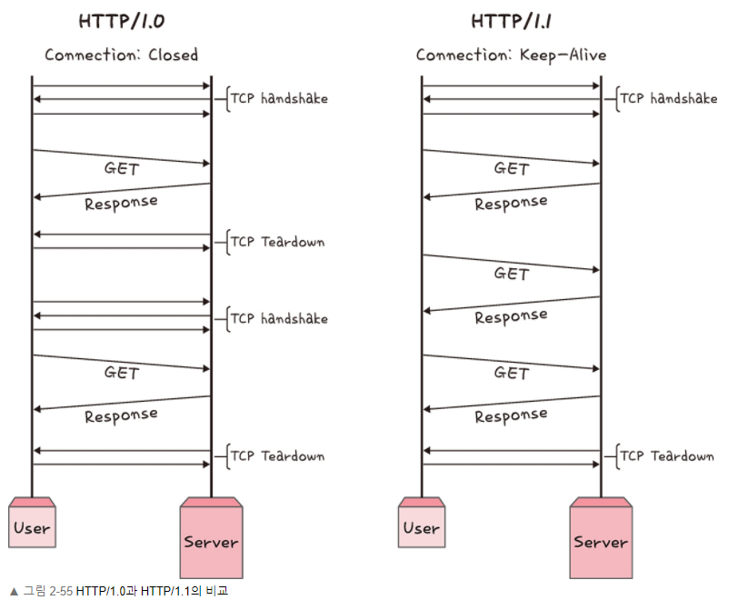
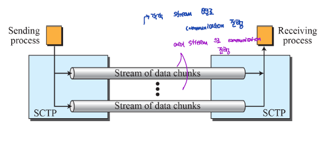
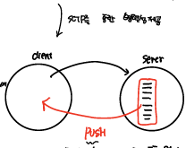
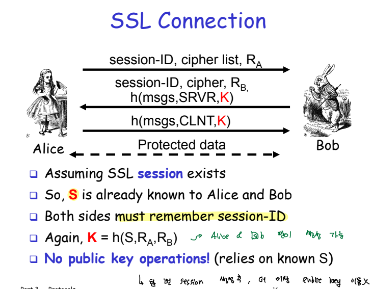

# Http

## Http 1.0

Http/1.0의 방식은 http 요청을 진행할 때마다 매번 새로운 TCP 연결을 설정하게 된다. 그렇기 때문에 RTT가 증가한다는 문제점을 가지고 있다.

RTT 증가를 막기 위해 이미지 스플리팅(여러 개의 이미자가 합쳐있는 하나의 큰 이미지를 다운 받는 것), Base64 방식의 인코딩을 통해 Html Object을 압축하기도 한다.

## Http 1.1

1.0 버전과 가장 많이 변한 부분이 TCP Connection 관련 부부이다. 1.0과는 달리 한번의 TCP connection을 통해 keep-alive한 상태로 여러 파일을 송수신 할 수 있도록 한다. 그리고 이러한 Http을 보고 persistent HTTP라고 한다.

하지만 HTTP 1.1이 가지는 문제가 있는데, HTML Object을 전송할때, 각 자원 바다 전송되는 속도가 다르다. 이러한 속도 차이로 인해 자원 별로 대기 시간이 발생하게 되는데 이를 Head Of Line Blocking 이라고 한다.

또한, 헤더에 많은 메타데이터가 포함되어 헤더 처리 과정이 복잡하다.

## Http 2.0

Http 1.1 방식에서 헤더 압축, 서버 푸시, 요청, 멀티 플렉싱과 같은 기능을 통해 더욱 응답시간을 줄일 수 있게 되었다.

> multiplexing

하나의 TCP connection에서 여러 개의 stream으로 분할하여 병렬적인 자원 전송이 가능하여 HOL 문제를 해결한다.

또한, 허프만 코딩 방식을 통해 빈도가 높은 데이터에 대해 적은 비트수를 빈도가 낮은 데이터에 대해서는 많은 비트 수를 적용하여 전체적인 데이터의 비트양을 줄일 수 있다.

> 서버 푸시

가령 html 파일을 요청하여 받아올 때 원래는 css, js 파일에 대해서는 추가적인 요청을 통해 서버로부터 받아와야했지만, 2.0 버전에서는 HTML object 내에 담겨있는 자원에 대해서 클라이언트의 요청 없이 서버가 푸시해서 자원을 넘겨준다.

## HTTPS

HTTPS 는 SSL/TLS 계층을 통해 HTTP 요청을 암호화하는 하는 것이다.

전송계층에서의 보안 방식으로 메세지 도청, 위변조를 방지한다.

SSL/TLS 계층을 이용해서 인증 메커니즘, 키 교환 알고리즘, 해싱 알고리즘의 보안 방식을 적용해서 보안 세션 기반으로 HTTP 전송을 진행한다.

> SSL/TLS Connection

클라이언트와 서버 간에 SSL Connection을 맺는 과정에서 비밀키를 공유하게 되고 해당 세션에서 사용할 수 있는 보안 알고리즘 리스트인 cipher suit가 전달된다.

> 인증서 

CA 인증서 내부에 서버와의 통신 과정에서 활용되는 공개키를 얻을 수 있다. CA라는 공인된 기업 인증기관을 통해 서버를 신뢰할 수 있게 된다.

CA 인증서를 발급받기 위해서는 해당 사이트의 필요 정보와 공개키를 담게 되고, CA에서는 CA 개인키를 이용해서 전자서명을 진행한다. 이후, 사용자 측에서는 CA 공개키를 이용해서 해당 인증서를 검증하게 된다.

> 암호화 알고리즘 

보통 암호키를 안전하게 공유하게 위해 암호화 알고리즘으로 Diffie-Hellman을 많이 사용한다.,

1. 소수 P,G을 송신한다.
2. A 사용자는 난수 a를 생성하여 Ga mod P 생성해서 B에서 전달한다.
3. B 사용자는 난수 b를 생성하여 Gb mod P 생성해서 B에서 전달한다.
4. 그러면 서로는 각자의 개인 난숙값을 활용해서 공유되는 비밀키는 Gab mod P를 생성하게 된다.

해당 알고리즘 보안의 핵심은 y=gxmod P 에 담겨 있는데, g,x,p를 알고 있는 상태에서는 y를 구하기 쉽지만, y,g,p만  알고 있는 상태에서는 x를 구할 수 없다. 따라서 공격자는 이러한 쉽게 비밀키를 계산해내지 못한다.

> 해싱 알고리즘

해시화하는 것은 데이터를 알아보기 힘든 형태로 변환하는 것을 의미한다. 해시함수를 적용해서 h(x) - > y를 수행하게 된다. 하지만 y -> x 과정을 못하게 끔한다.즉, 복호화 하기 어렵게 만들어 공격자로 하여금 알아보기 힘들게 한다.

Hello, Nice To Meet you를 3781cf50782b63dd7b045a1d5b09f60a3723d948d3d66b569a4d9d44f43c3c04 형태로 표현하여 기존의 메세지를 알아보지 못하도록 한다.

> HTTPS 구축 방법

- 직접 CA 인증키를 기반으로 HTTPS 서비스 구축
- HTTPS을 제공하는 로드밸랜서 활용
- HTTPS을 제공하는 CDN 활용

## HTTP 3.0

HTTP 3.0은 기존의 HTTP와 달리 TCP 대신에 UDP 방식을 활용한다. 2.0에서 제공되는 SCTP 기능은 3.0에서 지원된다.

UDP QUIC 기반으로 동작하는 HTTP 3.0은 별도의 3-way handshaking을 거칠 필요가 없어 연결설정 시간이 대폭 감소한다.

UDP 기반의 연결방식을 통해 기존의 TCP에서 강제로 수행되는 연결 작업, 신뢰성 데이터 전송을 위한 SEQ,ACK를 확인할 과정이 없어 전송 속도를 높이게 된다. UDP는 백지상태의 도화지라고 이해할 수 있는데, 이는 TCP에서는 필수로 적용되는 기능이 없고, ip, checksum과 같이 아주 간단한 정보만을 가지고 있다. 

UDP QUIC이 가지는 또 하나의 장점은 Connection ID를 통해 클라이언트와의 연결을 관리한다는 점에서 클라이언트의 IP가 변경되더라도 연결을 계속 유지할 수 있다는 점이다. wifi를 바꾸거나, cellular로 변경되는 상황에서, 클라이언트 측에서는 IP가 변경되지만 IP를 기반으로한 연결 과정이 없기 때문에 IP 변경으로 인한 연결이 종료되는 상황이 발생하지 않는다.

[HTTP_QUIC](https://evan-moon.github.io/2019/10/08/what-is-http3/)

## 웹사이트 접속 과정

주소창에 url을 입력하고 엔터를 누르면 어떠한 동작과정이 발생할까??

1. URL을 입려가게 되면 입력된 Domain을 통해 DNS는 IP를 변환하기 위해 계층적으로 상위 DNS로의 query을 보낸다.

2. IP로 변환된 정보를 바탕으로 해당 목적지 IP 까지 라우팅이 실시된다.

3. 이후 물리적 노드간의 링크 설정을 위해 ARP가 동작하여 해당 웹서버의 MAC주소를 받아오고 이를 통해 링크를 생성한다.

4. 실질적인 연결이 끝나게 되면 해당 웹페이지의 HTML Object을 받아오게 된다. 이러한 자원은 HTTP Proxy Server을 통해 캐싱한다.

[youtube](https://www.youtube.com/watch?v=5MM8NDzWHdE&feature=youtu.be)

## References

### Book
[면접을 위한 CS 전공지식 노트](http://www.yes24.com/product/goods/108887922)

