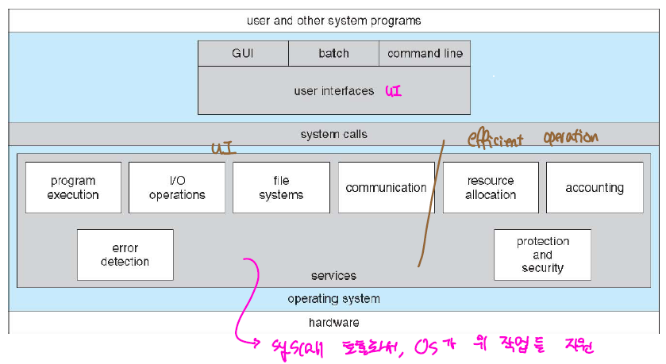

# OS

## OS Structure

HW와 SW 단 사이에 위치한 System Software로써 HW를 제어해서 SW에 기능을 제공하는 역할을 담당한다.



> OS Roles

- Resource/Process Scheduling: Resource는 한정된 자원으로 어떤 프로세스에 할당할 것인지를 OS에서 판별하게 된다. 가령, Memory, CPU와 같은 할당량을 제어하는 것을 의미한다. 또한 코어 1개는 1개의 프로세스를 처리할 수 있는데, 어떠한 프로세스를 처리할 것인지를 담당하는 역할을 수행한다.

- Memory Allocating: 메모리 자원 또한 한정된 자원이므로 여러 process가 나눠서 사용하게 되는데, 이러한 memory 영역을 관리하는 역할을 수행한다.

- Disk Scheudling: 디스크를 어떤 식으로 관리할 것인지에 대한 부분을 담당한다.

- I/O Scheduling: 각종 마우스, 키보드와 같은 입력 장치에 대한 처리가 요구된다.

무엇보다도, OS가 가지는 가장 중요한 특징은 Multiprogramming 과 MultiTasking 개념이다. 여러 프로그램을 메모리에 프로세스 형태로 적재 시켜 항상 프로세스가 동작할 수 있도록 하고, 빠른 context-switching을 통해 process를 짧은시간에 계속해서 교체하여 마치 여러개의 프로세스가 동시에 실행되는 것처럼 느끼도록 한다.(Concurrency, 하지만 multicore 개념이 등장하면서 parallel 실행이 어느정도 가능하게 되었다.)

> System Call


SW는 OS에서 제공하는 기능을 사용하기 위해 systemcall의 형태로 OS에 요청하게 된다. 하지만 이러한 systemcall을 직접적으로 호출하는 방식이 아닌 프로그래밍 언어로 제공되는 API를 활용해서 해당 기능을 사용한다. 이렇게 high-level language으로 설계된 API를 활용하여 portability 와 ease-of-use을 모두 만족시킬 수 있다.


systemcall을 받은 os는 kernel mode로 변경해서 해당 요청을 처리하고 다시 user-mode로 변경하게 된다. 이처럼 OS는 dual mode로 동작하게 되는데, 이는 user mode에서 허가되지 않는 기능의 수행으로 인해 시스템 전체에 영향을 끼치는 것을 방지하기 위해 System의 기능을 사용하는 경우에 대해서는 Kernel-mode로 변경해서 수행한다.

> Iterrupt Driven

OS는 인터럽트를 기반으로 동작한다. CPU는 process을 처리하고 있는 와중에, SW, HW에서 전달된 인터럽트를 받게 되면 처리하고 있던 process을 다른 곳에 저장하고 전달된 인터럽트를 우선적으로 처리한다. 이때 인터럽트 벡터를 참조해서 해당 인터럽트 처리를 진행하고 기존에 수행중이던 프로세스를 이어서 수행하게 된다.(**이러한 과정에서 처리 되는 프로세스 변경을 위해 register, pcb와 같은 정보를 교체하는 것을 Context-Switching이라고 한다.**) I/O 처리, 프로세스 오류와 같이 각종 이벤트에 대해 Interrupt을 이용해서 OS에 해당 이벤트가 발생하였음을 알려서 이벤트가 처리되도록 하는 방식이다.

인터럽트는 크게 SW, HW 방식으로 나뉘어지는데, SW 방식은 systemcall을 요청하거나, 프로세스 오류가 발생하였을 때 trap 형태로 OS에 전달하게 되고, HW의 경우 I/O 처리가 완료 되었을 때 이를 알리기 위해 인터럽트를 보내게 된다.

만일, 인터럽트 없이 CPU에서 process만 처리한다고 하면, I/O 요청이 들어왔을 때 해당 I/O 요청이 처리되는 동안 다른 process가 처리되지 못하고 I/O 요청이 끝나기를 기다릴 수 밖에 없다. 이러한 CPU 자원 낭비를 막고 CPU 할당량을 높이기 위해 인터럽트 기반으로 설계된다.

> Device Controller, Local Buffer, DMA


컴퓨터에 연결되는 각종 Device에는 위와 같이 device controller와 local buffer가 부착되는데, device controller은 각각의 device를 제어하기 위한 장치이다. OS는 이러한 device controller와 통신하기 위해 device driver가 요구되는데, 이것이 우리가 흔히 새로운 하드웨어를 부착했을 때 드라이버를 설치하라고는 할때 나오는 드라이버인것이다. 드라이버를 통해 OS는 device controller을 이해할 수 있게 된다.

I/O 처리 과정

1. driver는 device controller의 register을 설정한다.
2. controller는 register을 확인한다.
3. controller에서 data를 transfer한다.
4. 모든 data 이동이 완료되면 controller는 OS에 interrupt을 요청한다.
5. device driver은 제어권을 OS로 전달한다.

하지만, 이렇게 매번 CPU를 통한 I/O를 처리하게 되면 CPU 부하량을 높이게 되어, 다른 process처리에 시간이 걸리게 된다. 그래서 이러한 CPU를 거치는 대신에 직접적으로 메모리에 접근할 수 있도록 DMA가 제공된다. 

DMA 동작모드로는 2가지 방식이 있다.

|Mode|Description|
|--|--|
|Cycle Stealing|CPU가 DMA에 1번의 cycle을 양보해서 해당 cycle 동안 한 워드를 전송하게 된다. |
|Burst Mode|DMA가 버스 사용권을 획득하게 될 경우 모든 데이터를 전송을 완료할때까지 버스 사이클을 독점한다. 블록 단위의 데이터를 전송하게 된다.|

## Memory


메모리는 위와 같이 계층구조를 이루고 있다. 이는 데이터 처리 속도 빨라지는 대신에 그 만큼 가격이 비싸지고, 용량 또한 작아지기 때문에 데이터에 계층 구조를 둬서 이러한 문제를 해결하였다. 이러한 계층 구조를 통해 경제성과 캐시를 활용하게 되는 것이다. 불필요하게 무작정 비싼 저장장치를 사용할 필요없이 자주 사용되는 데이터를 빠른 저장장치에 저장하고 그외 나머지는 하위 계층의 저장장치에 저장한다.

### cache

또한, 느린 저장장치에 대한 병목 현상을 줄이기 위해 캐시가 활용된다. 상위 계층의 저장장치는 하위 계층의 저장장치의 캐시로 동작하게 되는데, 이때 캐시는 느린 저장장치에 존재하는 데이터를 빠른 저장장치에 복사를 해서 데이터 처리 시간을 줄일 수 있다. 즉, 굳이 느린 저장장치에서 데이터를 접근할 필요없이 상위 계층에 존재하는 경우 상위 계층에서 데이터를 받아오면서 데이터 저장장치 간의 처리 속도차이를 줄일 수 있다. 이때, 상위 계층의 저장장치에 데이터가 있는 것을 Hit이라고 한다. 그 반대의 경우를 Miss라고 하며, Miss가 발생하게 될때는 느린 저장장치에 접근해서 다시 데이터를 상위 계층으로 복사 해야하는 데, 이를 처리하는 과정을  Miss penalty라고 한다.

> cpu write handing


cpu에서 MM으로 데이터를 쓰고자 할때는 위와 같이 동작한다. 데이터 block를 작성 할때, 캐시와 MM 모두에 블록을 저장하는 방식은 write-throughd이고 캐시에만 작성하면 write-back 방식이다.


> Spatial Locality, Temporal Locality

캐시는 공간적, 시간적 지역성을 바탕으로 설정되는데, 하나의 데이터에 대해서 인접한 데이터가 추후에 이용되는 것을 공간적 지역성을 의미하며, 하나의 데이터를 나중에 또 접근하게 될 가능성이 높은 것을 시간적 지역성이라고 한다.

```python
arr=[1,2,3,4,5,6,7,8,9,10]
#계속해서 변수 i에 접근하게 되는 것은 시간적 지역성이라고 할 수 있다.
for i in range(10):
    #인접한 배열의 원소에 접근하는 것을 공간적 지역성이라고 한다.
    print(arr[i])
```

> cache mapping


캐시를 매핑하는 방식에는 위와 같이 3가지 방식이 있다.

|Mapping|Description|
|--|--|
|Direct-mapped|블록은 오직 하나의 주소에만 저장되기 때문에, hit time이 가장 짧지만, hit rate는 낮다.|
|fully-associative|블록은 어떠한 주소에도 저장될 수 있기 때문에, 모든 주소에 대한 검증이 요구되어 hit-time이 가장 길지만, hit rate는 가장 높다.|
|set-associative|direct+fully가 혼합된 방식으로 하나의 블록은 하나의 set에 저장될 수 있으며, hit 판별을 위해 해당 set을 모두 검증해야한다. 이렇게 하므로써 hit rate와 hit time을 모두 적절하게 설정할 수 있다.|

### Virtual Memory

MM 크기는 매우 한정되어 있기 때문에 무작정 메모리를 할당할 수는 없다. 그래서 이때 가상 메모리
방식을 활용한다. 프로세스의 경우 할당된 메모리 양보다 많은 양의 메모리를 요구하는 경우가 발생하지만, 동시에 모든 메모리를 활용하는 것은 아니기 때문에, Virtual Memory를 활용해서 실제 할당되는 것보다는 큰 메모리인 것 처럼 보이게 하며, 해당 메모리를 필요로 할때 disk 로 부터 가져오는 작업을 수행한다.


이러한 Virtual Memory의 경우 실제 MM에 저장되는 주소와 달라지기 때문에 OS는 이러한 Logical Address와 Physical Address간의 변환을 위해 MMU 장치를 활용한다.

### Memory Allocation
OS는 프로세스가 사용하는 메모리를 메인 메모리에 할당해야하는데, 이때, base address, offset을 활용하여서 메모리 할당 여부를 관리하게 된다.

#### Continous allocation
우선적으로 메모리를 연속적으로 할당하는 방식이 있다. 처음부터 순차적으로 프로세스에 대한 메모리를 할당하게 된다. 

> 고정 크기 할당

메모리를 고정된 크기의 프레임으로 나눠서 해당 영역에 프로세스를 할당하는 방식이다. 이렇게 고정 크기로 할당하게 될 경우 모든 프로세스가 동일한 메모리 크기를 할당받게 되는데, 이렇게 될 경우 해당 메모리 크기를 다 쓰지 못하는 내부 단편화가 발생한다.

> 가변 크기 할당

프로세스 크기에 맞게 가변적으로 메모리를 할당하는 방식이다. 빈 공간이 있으면 해당 메모리 공간을 프로세스에 할당하게 된다. 하지만 이 방식의 경우 내부 단편화는 발생하지 않지만 외부 단편하는 발생하게 된다. 이는 홀을 모두 하나로 합쳤을 때는 충분한 양의 메모리 공간이 있지만, 모두 분리되어 있어 프로세스에 메모리 할당할 수 없는 경우를 의미한다.

|Finding Methods|Description|
|--|--|
|First-fit|가장 처음 만나는 홀을 할당한다.|
|Worse-Fit|요구되는 메모리 크기와 가장 차이가 나는 홀을 할당한다.|
|Best-Fit|요구되는 메모리 크기와 가장 차이가 적은 홀을 할당한다.|

현대 운영체제는 위와 같이 연속적인 할당 방식이 아닌 불연속적인 할당 방식을 취한다. 프로세스 하나에 대해서 여러 조각으로 분리되어 메모리 전반에 걸쳐서 분산되어 배치된다. 이러한 불연속적인 할당 방식에는 대표적으로 segmentation과 paging이 있다.

#### Segmentation


segmentation은 하나의 프로세스를 가변 크기의 segmentation으로 분할해서 관리하는 방식이다. 보통 코드, 데이터, 함수 단위를 프로세스를 분할할 수 있다. 


segmentation table을 이용해서 segmentation이 MM에 어디세 위치한 지를 계산할 수 있다.

#### Paging


segmentation이 가변 크기의 메모리로 분리해서 저장했다면, paging은 고정 크기의 페이지 형태로 MM의 frame에 저장하는 방식이다.

page 개수가 많아 짐에 따라 Page-table의 entry가 증가하게 되는데, 이를 위해 hierarchical paging, hashed page table, inverted page table 방식을 취하기도 한다.

##### Page Fault


실제 프로세스에 할당된 메모리의 크기는 vitual memory보다 작다. 그렇기 때문에 실제 MM에 없는 page에 접근하고자 하는 경우 page fault가 발생한다. 따라서, 이러한 page를 가져오는 작업을 위와 같이 수행해야한다. 

page fault 처리 과정

1. page fault가 발생하면 os에 interrupt가 발생한다(SW trap)
2. Disk에 page가 존재하는 지 확인한다.
3. 있으면 MM에 로딩하고 Page table을 갱신한다.
4. 제어권을 다시 OS에 넘긴다.


##### Page Replacement


하지만, 만약에 MM에 여유 있는 frame이 없는 경우에는 위와 같이 기존에 할당되어 있는 page를 disk로 내보내는 작업을 수행해야한다. 이를 Swapping이라고 한다.

스와핑이 빈번하게 발생하게 되면 이를 처리하는 데 걸리는 시간이 증가하게 되므로 어떠한 page를 교체할 지를 선택하는 과정은 매우 중요하다. 이러한 page-replacement을 수행하는 알고리즘은 아래와 같이 존재한다.

> FIFO


가장 먼저 들어온 페이지를 제거한다.

> LRU


가장 사용된지 오래된 페이지를 제거한다.


lru를 구현하기 위와 같이 second-change algorithm을 방식으로 구현한다. reference bit가 1이면 이는 해당 페이지가 사용되었음을 의미하고, 최근에 0은 사용되지 않았음을 의미한다. 각각의 페이지를 순환하면서 해당 페이지의 reference bit가 1임을 확인하면 이를 0으로 교체하고 다시 순환을 실시한다. 이때 0을 만나게 되면 해당 페이지를 제거한다. 즉, page에 대해 무작정 교체하는 것이 아니라, 한 번 0으로 설정해서 해당 페이지가 다시 참조되는 지를 확인해서, 참조되지 않을 때(근래에 사용되지 않는 경우) 제거한다.

더 나아가서, modified bit을 추가해서 고려하게 되면 더욱 효율적으로 page-replacement을 처리할 수 있게 된다. (modified bit가 0인 경우 해당 페이지는 수정되지 않았기 때문에 디스크로 swap-out 할 필요가 없기 때문에 해당 과정을 생략할 수 있다.)

> Thrashing


multiprogramming level에 따라 CPU scheduler의 동작하는 과정이 제어된다. multiprogramming level이 높은 경우 long-term scheduler에 의해 CPU 이용률을 높일 수 있도록 많은 양의 프로세스가 ready queue에 할당이되고, 반대의 경우 process을 제거한다.

하지만, 어느 순간 이상 높아 지게 되면 MM에 할당 가능한 메모리의 크기가 줄어 들게 되면서 하나의 프로세스를 처리하는 과정에서 수많은 page-fault 과정이 발생하게 되는데 이를 Thrashing이라고 한다.

Multiprogramming level이 증가하게 되면서 page 할당량을 증가하게 되며, 각각의 process 처리 과정에 있어 필요한 process도 증가하게 되여, 그 만큼 page fault가 빈번하게 발생한다. 그렇게 되면 page-fault를 처리하는 과정 동안 CPU는 page fault가 처리되는 동안 idle 상태를 유지하게 되고, 그렇게 되면 cpu 이용률이 낮아져서 cpu scheduler을 이를 보고 multiprogramming level을 늘리게 된다. 이러한 악순환이 반복되면서 cpu 이용률은 기하급수적으로 감소하게 된다.

이러한 Thrashing을 예방하기 위해서는 process에 충분 양의 frame을 할당해야한다. 이러한 방법에는 아래와 같이 2가지가 존재한다.

> Working-set


이전에 사용된 페이지 정보를 토대로 프레임 개수를 설정하는 것이다. 이전의 페이지 참조 기록을 토대로 WSS을 조사해서 해당 프로세스가 page-fault가 발생하지 않기 위해 필요한 frame 개수를 계산해서 해당 frame 개수 만큼 할당 가능하다면 thrashing이 예방된다.

> PFF


thrashing은 page-fault가 너무 많이 발생할 때 발생하는 문제이다. 그렇기 때문에 위와 같이 process에 할당되는 frame 개수를 조절하면서 page-fault rate가 적당히 발생하는 시점을 찾는다. 

## References

### Book
[면접을 위한 CS 전공지식 노트](http://www.yes24.com/product/goods/108887922)


