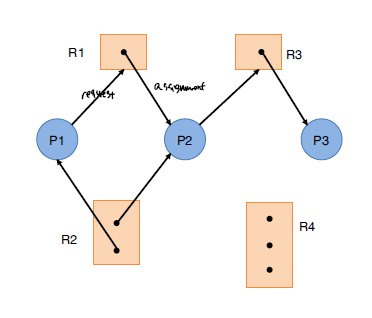

# OS

## Process

파일 형태로 디스크에 저장된 program은 CPU resource, RAM을 할당 받아서 실행가능한 process 형태로 변환되어서 CPU에서 처리된다. 이러한 process는 CPU scheduling의 대상이 되는 task이다.

> Program -> Process

우리가 흔히 작성하는 C, Java 등의 언어로 작성된 소스 코드는 컴파일, 링커, 로더를 거쳐서 실행가능한 process로 
동작하게 된다.


1. 소스코드는 우선적으로, 컴파일러와 어셈블리어를 거쳐 목적 코드를 생성하게 된다. 

2. 그후, 링커를 통해 각종 라이브러리와 목적 코드를 합쳐서 하나의 실행 가능한 파일로 만든다.

- 링커가 동작하는 방식으로 static linking 과 dynamic linking이 존재하는데,

static linking의 경우 모든 라이브러리를 .exe에 모두 포함시키는 방식이고, dynamic의 경우 외부 공간인 메모리에 라이브러리를 탑재해서 해당 주소로의 참조를 통해 라이브러리를 활용하는 방식을 취한다.

3. 최종적으로 로더에 의해 실행 파일은 메모리에 할당 되게 된다.


### Process Memory 


process은 위와 같은 메모리 구조를 가진다. 모든 process은 위와 같은 메모리 구조를 가지고 있으며 크기가 4GB인 메모리 공간을 할당받게 된다. 실제 MM과 Virtual Memory 간에 관계를 살펴보면 아래와 같이 Virtual Memory가 MM에 매핑되어 있다.


|memory structure|descriptions|
|--|--|
|Stack|스택 영역은 함수 호출에 관련된 부분으로 지역변수, return address, register와 같은 정보를 저장한다. 함수가 재귀적으로 호출되면서 아래로 동적으로 커진다. 프로세스에서 실제 실행의 흐름을 총괄하는 영역이다.|
|Heap|동적 할당과 관련된 영역으로 배열과 같은 동적 메모리를 저장하는 영역이다.|
|Data|전역변수, static 변수를 저장하는 공간|
|Text|실행되는 코드가 포함되는 영역이다.|

### Process State


process은 컴퓨터에서 위와 같은 상태를 가지게 된다. 

|State|Description|
|--|--|
|New|프로세스가 생성된 상태, 프로세스 생성방식에는 fork, exec을 활용하는 방식이 존재한다.|
|Ready|프로세스는 생성 이후, Long-term Scheduler에 의해서 CPU의 처리를 대기하는 상태로 된다.|
|Running|CPU 자원을 할당 받아 실제 프로세스가 동작하고 있는 상태|
|Block|I/O를 위해 대기하고 있는 상태|
|terminated|process가 제거된 상태, 프로세스가 종료되는 경우에는 정상적으로 종료되는 경우도 있지만, 비정상적으로 자원을 많이 요청해서 부모 프로세스에 의해서 강제로 종료되는 경우도 있다.|

이외에도 Zombie Process라는 것도 존재하는데, 이는 자식 프로세스 처리를 완료하였지만, 부모 프로세스가 자식 프로세스의 반환값을 요청하지 않고, 부모 프로세스가 종료된 상태로, Process Table에 남아있는 경우이다.

### PCB


Process는 위와 같은 PCB를 이용해서 관리되는데, PCB는 Prcoess에 관한 메타정보로 이해하면 된다. Ready Queue, Running Queue, Waiting Queue 모두 이러한 PCB을 이용해서 링크드 리스트 형태로 저장하게 된다.

PCB에는 process_id, process state, program counter, register, memory allocation 정보와 같은 프로세스 처리 과정에 있어 필수적으로 요구되는 정보를 저장하게 된다.

> Context Switching


CPU는 하나의 process만을 계속해서 실행하는 것이 아니라, 여러 process에 대해 time slice를 나눠서 빠르게 process을 교체하는 방식으로 실행한다. 이때, Process switch 과정에서 cpu에 할당된 register, program counter와 같이 process 실행에 필요한 정보를 담은 PCB를 교체하는 작업이 요구되는데 이를 Context Switching이라고 한다.

즉, 하나의 process을 실행하다가, 교체를 위해 기존의 PCB를 저장하고, 다음에 처리하고자 하는 process에 대한 PCB를 로드 해서 다음 process을 처리한다.

**CPU가 interrupt을 처리하는 과정에서 현재 실행 중이던 PCB를 다른 곳에 저장하는 것 또한 context-switching의 일환이다.**

### IPC

Process은 메모리 영역을 독립적으로 가지고 있어, 프로세스는 개별 환경에서 다른 프로세스의 간섭 없이 동작하게 된다. 하지만 프로세스 간에 데이터를 주고 받아야하는 경우가 발생하는데, 이를 위해 OS에서는 2가지 방식의 IPC를 제공한다.

> Shared Memory

shared memory의 경우 공유되는 메모리 영역을 이용해서 여러 프로세스가 공유 메모리를 통해 데이터를 주고받을 수 있게 한다.

보통 두 프로세스 간에 공유 버퍼를 설정하여 동작한다. Producer/Consumer 개념에서 Buffer을 공유하는 상태에서 진행되는 로직이 이에 해당한다.

> Pipe

Pipe가 shared memory를 활용한 방식 중 하나이다.


부모 프로세스와 자식 프로세스 간에 통신을 위해 pipe을 활용하는데, 부모 프로세스에서 파이프를 만들고 fork을 실행하게 되면 자식 프로세스에서도 해당 파이프에 대한 접근이 가능하다. 파이프의 경우 한쪽 방향만 존재하는 단방향 방식의 데이터 전송을 진행한다.


일반적인 파이프의 경우, 파이프를 생성한 프로세스에서만 접근이 가능하고 파이프는 프로세스의 생명 주기를 따라간다. 

하지만 named pipe을 활용하면 부모/자식 프로세스 관계가 아니더라도 여러 프로세스가 named pipe을 활용할 수 있다.

> Message Passing

두 프레스 간에 메세지 큐를 통해 메세지 방식으로 데이터를 주고 받을 수 있다. 작은 양의 데이터를 보내는데 뷰이라고, shared memory 방식에 비해 구현하기 쉬운 장점이 있다. 하지만 커널이 직접 메세지 교환을 전담한다는 관점에서 느리다.

### Process Scheduling

page fault을 처리하기 위해 교체할 page를 선택하는 page replacement algorithm과 같이 process 또한 어떠한 Process을 처리할 지 여부를 선택하는 Process Scheduling이 존재한다. cpu 이용률 높이고, multiprocess 환경에서 각각의 process에 공정한 실행 기회를 제공하기 위해 process scheduling이 이루어 진다.

process scheduling은 크게 2가지로 나뉘어지는데, process 처리를 강제로 종료할 수 있는 preemptive 방식과, 특정 process가 모두 처리된 이후에 다른 process로 교체할 수 있는 nonpreemptive 방식이 존재한다.

#### Nonpreemptive

nonpreemptive, 즉 비선점형 방식으로는 FCFS, SJF, Priority 방식이 존재한다.

> FCFS(First Come First Served)


먼저 들어온 process부터 처리하는 방식이다. 앞에 수행 시간이 긴 프로세스가 들어오게 되면, 뒤에 수행시간이 짧은 프로세스들이 오래 기다리는 경우가 발생하는데, 이를 Convoy Effect라고 한다. 

> SJF(Shortest Job First)


수행시간이 짧은 작업부터 먼저 처리한다. 하지만 프로세스의 수행 시간을 정확한 수치를 알기는 어려우므로 이전의 수행 시간을 바탕으로 근사치를 계산해서 수행 시간을 예측하는 방식으로 진행한다.

> priority


프로세스 간에 우선순위를 기반으로 scheduling을 수행한다. memory 사용량, file 처리, cpu/io 비율과 같은 수치를 활용하여 우선순위를 설정하기도 하며, 해당 프로세스의 중요성, 프로세스 종류와 같은 외부적 수치를 활용하기도 한다.

이러한 priority 기반의 scheduling의 경우 우선순위가 낮은 프로세스는 처리되기 까지 오래 걸리는 Starvation 문제가 발생하는데, 이를 해결하기 위해 점진적으로 우선순위를 높이는 Aging이 적용되기도 한다.

#### Preemeptive

선점형 방식으로, 프로세스를 강제로 종료하고, 새로운 프로세스로 대체한다. 이렇게 강제로 종료시킬 수 있기 때문에, race condition, systemcall handling과 연관된 문제가 발생하기도 한다. 공유자원을 처리하고 있는 와중에 프로세스가 종료되거나, 시스템콜을 처리하는 와중에 종료되어, 시스템에 영향을 끼칠 수 있다.

> SRF(Shortest-Remainig-First)


SJF와 동일한 방식으로 동작하지만, preemptive하게 동작하는 부분만 차이가 존재한다.

> Round-Robin


미리 정의한 time-quantum 만큼씩 모든 process을 순차적으로 실행하는 방식이다. 이는 multitasking 개념에 정확하게 부합되는 개념으로 여러 process를 골고루 실행시키는 것이다. time quantum을 얼마나 설정하냐에 따라 해당 scheduling 알고리즘의 성격이 달라지게 되는데, time quantum을 크게 잡으면 FCFS와 유사하게 동작하게 되고, 짧게 잡으면 process switching 과정이 빈번하게 발생되어 그 만큼 context switching 과정이 많이 발생하게 된다.

> Multilevel Queue


해당 방식은 여러 process에 대해 서로 다른 group으로 분류해서 각각의 그룹을 처리하기 위해 서로 다른 scheduling 방식을 적용하는 방식이다. 각각의 프로세스는 서로 다른 목적, 요구사항을 갖고 동작하기 때문에 서로 다르게 관리해야되는 경우가 존재한다. 이때 Multilevel을 활용한다. 각각의 level은 서로 다른 scheduling algorithm을 가지며, 각각 우선순위가 달라 순서대로 처리가 된다.

하지만, priority가 낮은 queue에 속한 process들은 처리되기 까지 시간이 많이 걸리는 문제가 발생한다. 

> Multilevel Feedback Queue


multilevel queue가 가지는 starvation 문제를 해결하기 위해 Queue 간에 프로세스 이동이 가능하도록 하여 우선순위가 낮은 프로세스에 대해서도 실행되도록 한다. 첫단계의 queue에는 time quantum을 짧게 잡아서 반응성을 요하는 프로세스들을 빠르게 처리할 수 있도록 하고 밑으로 갈수록 실행시간이 긴 process들이 포진하게 된다.


#### Preemptive

## Thread


여러 작업을 동시에 처리하기 위해 Multiprocess을 활용하기도 하지만, Process 자체는 매우 무거운 자원에 속한다. 하나의 Process을 추가로 할당하기 위해 process_id, register, memory, 등의 resource를 할당받아야하는데, 이는 resource를 많이 잡아 먹게 된다. 그래서 나온 대안이 Multithread이다. 하나의 Process에서 thread라는 여러 실행 흐름을 분기해서 하나의 프로세스에서 여러 개의 작업을 동시에 처리할 수 있도록 한다.

이러한 Thread를 활용하게 되면 하나의 process 내에서 code, date, heap 영역을 서로 공유하기 때문에 thread 간에 데이터를 주고받는 과정은 IPC 보다 훨씬 수월하다. 또한 병렬적으로 작업을 수행하기 위해 process을 새로 생성하지 않고 thread을 이용하게 되면서 resource를 효율적으로 활용할 수 있다. 

single core에서 multi core 환경으로 변화하게 되면서 multithread 기반의 작업 처리는 빛을 보기 시작했다. core 1개에 thread 1개를 실행하면서 parallelism 수준도 올라가게 된다.

### Thread Models


user thread는 programming language에서 생성되는 thread 개념이고, kernel thread는 CPU에서 동작하는 thread 개념으로 실제 스케쥴링 되는 대상이 된다. 

user-thread와 kernel thread 간에 매핑되는 방식에 따라 Thread을 구현하는 방식은 위와 같이 크게 3가지 방식이 존재한다.

1. N to 1 Model

user level에서 thread을 관리하기 때문에 효율적으로 thread을 생성할 수 있지만, 실제로 동작하는 kernel thread는 1개이기 때문에 system blocking이 빈번하게 발생한다.

2. 1 to 1 Model

User level에서 생성되는 user thread에 kernel thread가 1개씩 매핑되는 구조로 parallelism level이 가장 높지만 kernel thread을 많이 사용하게 되므로써 kernel thread 생성에 시간을 많이 사용하게 된다.

3. Many to Many Model

N to 1이 가지는 blocking 문제와 1 to 1 이 가지는 무분별한 kernel thread 생성 문제를 모두 해결한 model로, user thread을 원하는 만큼 생성할 수 있으며, 그에 따른 concurrency도 어느정도 충족할 수 있게 되었다.

> Thread Pool


매번 작업의 요청에 새로운 thread를 생성하고, 다 쓴 thread를 제거하고, 또 새로운 작업의 요청에 따라 thread를 생성하는 작업을 반복하는 것은 낭비이다. thread를 생성하는 작업 또한 작업 처리 시간을 잡아먹는다. 또한 무분별하게 thread을 생성하게 되면 system resource를 모두 소모 해버리게 되는 문제가 발생할 수 있기 때문에, 만들 수 있는 Thread 개수를 제한할 필요가 있다. 이 두가지 문제를 모두 해결하는 개념이 Thread Pool이다. 사전에 미리 Thread를 만들어 놓고 필요할 때마다 thread을 요청하고 작업을 완료한 Thread는 다시 Thread Pool에 저장한다. 이렇게 하므로써 Thread 생성/소멸 시간을 줄일 수 있고, Thread 개수를 제한하므로써 system resource도 다 소모 해버리는 경우가 발생하지 않게 된다.

## Critical Section

공유되는 자원에 두 개이상의 프로세스, 스레드가 동시에 접근하게 되면 실행 순서에 따라 결과가 달라지는 문제가 발생하는데, 이를 race condition이라고 한다. 그리고 이러한 race condition이 발생하는 영역은 critical section 이라고 한다.

아래와 같이 counter 라는 공유 변수에대해 서로 다른 연산을 수행하는 thread가 있다고 가정하자.
```
register1=counter
register1=register1+1
counter=register1

register2=counter
register2=register2-1
counter=register2
```

counter가 5에서 시작했을 때, thread1,thread2의 작업을 거치고 나면 5로 유지되어야한다. 하지만 아래와 같이 thread 실행 순서에 따라 실행 결과가 달라지는 문제를 확인할 수 있다.

```
register1=counter       #register1=5
register1=register1+1   #register1=6
register2=counter       #register2=5
register2=register2-1   #register2=4
counter=register1       #counter=6
counter=register2       #counter=4
```

```
register2=counter       #register2=5
register2=register2-1   #register2=4
register1=counter       #register1=5
register1=register1+1   #register1=6
counter=register2       #counter=4
counter=register1       #counter=6
```

위와 같이 공유되는 변수인 counter에 대해 여러 개의 process, thread가 동시에 접근하게 되면 의도한 실행 결과를 보이지 않을 수 있다. 이러한 문제를 해결하기 위해서는 race condition이 발생할 수 있는 critical section에 대해서는 항상 하나의 process,thread만 진입할 수 있도록 해야한다. 이를 위해 mutex, sempahore가 존재한다.

> Mutex

Mutex은 SW 기반의 lock 방식으로 특정 process가 critical section을 진입할 때 lock을 걸어, 다른 process가 진입하지 못하도록 막는다. 다른 process가 critical section 실행을 위해서는 현재 critical section을 처리하고 있는 process가 lock을 해제해야한다.

> Semaphore

Mutex가 lock 1개를 이용해서 통제를 진행하는 방식이었다면, semaphore은 여러개의 lock를 활용할 수 있다. 또한, lock을 할당 하고, 해제를 특정 프로세스에 한정되어 실행되는 것이 아니라, critical section에 접근하고자 하는 모든 프로세스가 wait, signal을 통해 lock을 요청, 해제할 수 있다.

semaphore는 lock의 개수에 따라 binary semaphore와 counting semaphore로 분류된다. binary semaphore의 경우 mutex와 유사하게 1개의 lock을 활용하는 방식이며, counting semaphore의 경우 n개의 lock를 활용한다.

Critical Section 문제를 해결하기 위해서는 아래의 3가지 조건을 만족해야한다.

|Requirements|Description|
|--|--|
|Mutual Exclusion|critical section에는 하나의 process만 동작한다.|
|Progress|critical section에 들어가고자 하는 process에 대해서만 lock를 할당하기 위한 경쟁상태로 둔다. 즉 들어가고자 하는 process에게만 기회를 준다.|
|Bounded Waiting|유한한 시간 내에 critical section을 처리할 수 있도록 한다.|

## Deadlock

한정된 자원이 있는 시스템에서 프로세스가 사용하고자 하는 자원이 다른 프로세스에 의해 할당되어 있고 그 프로세스 또한 다른 자원을 기다리고 있어 모든 자원 간에 의존관계가 형성되어 영원히 자원을 할당 받지 못하는 상태를 의미한다.

이러한 교착상태를 만족하기 위해서는 아래의 4가지 조건을 만족해야한다.

|Requirements|Description|
|--|--|
|Mutual Exclusion|모든 자원은 공유가 불가능한 상태이다.|
|NonPreemption|강제로 자원을 반환하지 못한다.|
|Hold and Wait|프로세스는 자원을 가지고 있는 채로 다른 자원을 요청한다.|
|Circular Wait|P1 이 P2가 가지고 있는 자원을 요청하고, P2는 P3가 가지고 있는 자원을, ...PN은 P1이 가지고 있는 자원을 요청하여 프로세스 간에 순환 요청이 발생한 상태|



Deadlock이 발생하는지를 판단하기 위해 위와 같은 resource allocation graph을 통해 process, resource 간에 cycle 여부를 판단하여 자원 요청 간에 deadlock이 발생하는지를 판단할 수 있다. cycle이 없는 경우는 deadlock이 발생하지 않는 safe-state이고, cycle이 발생하더라도 multiple resource로 인해 deadlock이 아닐 수 있는 경우가 존재한다.

DeadLock를 해결하는 대표적인 방법으로 Banker's alogrithm이 있다. Banker's Algorithm을 통해 모든 요청을 수용할 수 있는 safe-sequence를 찾고, 해당 safe-sequence에 따라 자원 요청을 처리한다. 

만약, Deadlock를 처리할 수 없는 경우에는 강제로 process termination, resource preemption을 고려하기도 한다.

## References

### Book
[면접을 위한 CS 전공지식 노트](http://www.yes24.com/product/goods/108887922)


