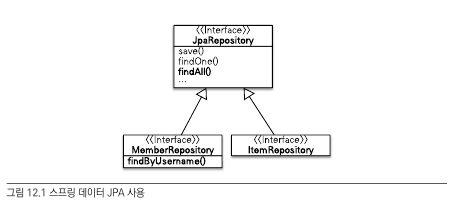
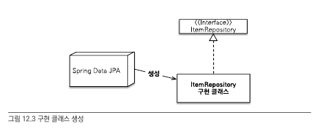
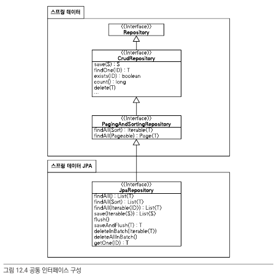

# Spring Data JPA

## JPA Limitations

> MemberRepository

```java
@Repository
public class MemberRepository {

    @PersistenceContext
    EntityManager em;

    public void save(Member member) {
        em.persist(member);
    }

    public Member findOne(Long id) {
        return em.find(Member.class, id);
    }

    public List<Member> findAll() {
        return em.createQuery("select m from Member m", Member.class)
                .getResultList();
    }

    public List<Member> findByName(String name) {
        return em.createQuery("select m from Member m where m.name = :name", Member.class)
                .setParameter("name", name)
                .getResultList();
    }
}
```

> Item Repository

```java
@Repository
public class ItemRepository {

    @PersistenceContext
    EntityManager em;

    public void save(Item item) {
        if (item.getId() == null) {
            em.persist(item);
        } else {
            em.merge(item);
        }
    }

    public Item findOne(Long id) {
        return em.find(Item.class, id);
    }

    public List<Item> findAll() {
        return em.createQuery("select i from Item i",Item.class).getResultList();
    }
}
```

위와 같이 Data를 CRUD 하는 부분이 중복된다. 그렇다고 부모 클래스를 만들고 이를 상속을 통해서 한다고 해도 구현 클래스를 상속해야 된다는 부분이 여전히 존재한다. 이를 간편하게 인터페이스만으로 구현할 수 있게 해주는 것이 Spring Data Jpa이다.

## Spring Data Jpa
Spring Data Jpa를 이용하게 되면, 인터페이스 명시만으로 자동적으로 구현객체가 동적으로 생성되어, 중복된 CRUD 코드를 작성할 필요가 없게 만든다.

위의 예제를 아래와 같이 Spring Data로 표현하면 간략화할 수 있다.

> MemberRepository

```java
@Repository
public interface MemberRepository extends JPARepository<Member,Long>{
    public List<Member> findByUsername(String name);
}
```

> Item Repository

```java
@Repository
public interface ItemRepository extends JpaRepository<Item,Long> {
}
```

 

Spring Data Jpa는 위와 같이 JpaRepository를 상속하는 Repository에 대해서 공통 기능을 제공한다.

만약, findByUsername 처럼 공통으로 처리 할 수 없는 메소드가 있다면, Spring Data Jpa는 내부적으로 해당 메소드에 대해서 아래의 jpql을 자동으로 실행한다.

```sql
select m from Member m where username=:username
```

위와 같이 Interface 상속만 표현 해놓으면 애플리케이션 실행 시점에 구현객체를 동적으로 제공한다.

### Configurations

>pom.xml

```xml
<!-- 스프링 데이터 JPA -->
<dependency>
    <groupId>org.springframework.data</groupId>
    <artifactId>spring-data-jpa</artifactId>
    <version>${spring-data-jpa.version}</version>
</dependency>
```
spring-data 관련 라이브러리를 추가해줘야한다.

>appconfig.xml

```xml
<jpa:repositories base-package="jpabook.jpashop.repository" />
```
jpa repository에 관한 설정을 추가하고, repository를 찾을 위치를 지정한다.



위와 같이 환경설정을 진행하면, JpaRepository를 상속하는 interface에 대해 spring data에서 구현 클래스를 생성한다.


### Common Functions

JpaRepository를 상속하는 Repository에 대해서는 다양한 공통 기능들을 제공해준다. 

```java
public interface MemberRepository extends JpaRepository<Member,Long>{}
```

와 같이 ```JpaRepository<Entity,Id type>```와 같이 엔티티와 엔티티의 식별자 타입을 명시해주면 된다.



Spring Data Jpa는 위와 같은 구조로 되어 있다.
위와 같은 interface 상속 구조를 통해 다양한 기능들에 구현되어 있어, 개발자가 구현하고자하는 웬만한 기능은 이미 다 구현되어 있다.

대표적으로 아래의 메소드들을 지원한다.

|Methods|Description|
|--|--|
|save|새로운 엔티티 저장, 새로운 엔티티이면 persist, 수정되는 엔티티인 경우 merge를 수행한다.|
|delete|엔티티 제거|
|findOne|식별자값을 기준으로 엔티티 조회|
|getOne|엔티티 프록시 조회|
|findAll|모든 엔티티 조회|

### Query Method

이것은 Spring Data Jpa가 제공해주는 강력한 기능 중에 하나이다.

Method 이름만 보고 적절한 쿼리를 생성해주는 기능이다.
이외에도 namedQuery 호출, 쿼리 직접 정의등의 기능을 제공한다.

#### 메소드 이름으로 쿼리 생성

```java
public interface MemberRepository extends JpaRepository<Member,Long>{
    List<Member> findByEmailAndName(String email,String name);
}
```
위와 같이 email 과 name을 이용해서 member에 대한 조회를 하는 메소드를 정의하게 되면 자동으로 아래의 jpql를 생성한다.

```sql
select m from Member m where m.email= ?1 and m.name =?2
```

위와 같은 기능을 사용하려면 물론 메소드 정의규칙에 따라 메소드를 작성해야한다.

Examples
|Keywords|Sample|JPQL snippet|
|--|--|--|
|And|findByLastnameAndFirstname	|… where x.lastname = ?1 and x.firstname = ?2|
|Or|findByLastnameOrFirstname|… where x.lastname = ?1 or x.firstname = ?2|
|Between|findByStartDateBetween|… where x.startDate between 1? and ?2|
|LessThan|findByAgeLessThan|	… where x.age < ?1|

이외에도 다양한 메소드에 대해 지원한다. 아래의 공식문서를 통해 추가로 확인할 수 있다.

[query methods](https://docs.spring.io/spring-data/jpa/docs/1.3.0.RELEASE/reference/html/jpa.repositories.html)

#### 메소드 이름을 통해 NamedQuery 호출

메소드를 이용해서 사전에 정의한 namedquery를 호출하는 것이 가능하다.

> Defining Named Query

```java
@Entity
@NamedQuery(
    name="Member.findByUserName",
    query="select m from Member m where m.username=:username"
)
public class Member{

}
```
위와 같이 정의된 named query가 있다고 했을때,

아래와 같이 메소드 이름을 지정하면 자동으로 namedquery가 호출된다.

```java
public interface MemberRepository extends JpaRepository<Member,Long>{
    List<Member> findByUsername(@Param("username") String username);
}
```

기본적으로 Spring Data Jpa에서는 domain.method 이름으로 named query를 탐색하게 된다. 그래서 위의 경우 Member.findByUsername이 호출되는 것이다.

만약 namedQuery가 없으면 메소드 생성 단계로 가게 된다.

@Param annotation은 username에 대한 파라미터 바인딩을 위해 사용된다. 기본값은 위치 기반 파라미터 바인딩인데, 가독성을 위해 이름 기반 파라미터 바인딩을 활용하는 것이 좋다.

#### @Query, Repository에 바로 쿼리 정의

메소드에 쿼리를 직접 정의하는 것 또한 지원한다.

```java
public interface MemberRepository extends JpaRepository<Member,Long>{
    @Query("select m from Member m where m.username = ?1")
    List<Member> findByUsername(String username);
}
```
위는 정적 쿼리는 직접 정의하는 것과 같은 느낌으로, 이름 없는 NamedQuery라고 하기도 한다.

native sql에 대해서도 처리가 가능하다.

```java
public interface MemberRepository extends JpaRepository<Member,Long>{
    @Query("select m from Member m where m.username = ?0",nativeQuery=true)
    List<Member> findByUsername(String username);
}
```
nativeQuery를 true로 설정하고, 위치 기반 파라미티러는 0부터 시작하게 된다.

> 벌크성 수정 쿼리

```java
int bulkPriceUp(String stockAmount){
    String qlString=
    "update Produce p set p.price=p.price*1.1 where p.stockAmount < : stockAmount";

    int resultCount=em.createQuery(qlString).setParameter("stockAmount",stockAmount).executeUpdate();
}
```

위와 같이 일정 재고량 미만인 제품에 대해 일괄적으로 가격을 10% 인상하는 쿼리가 있다고 하자.

이러한 수정쿼리는 아래와 같이 지정할 수 있다.

```java
@Modifying
@Query("update Produce p set p.price=p.price*1.1 where p.stockAmount < : stockAmount")
int bulkPriceUp(@Param("stockAmount") String stockAmount);
```

벌크성 수정,삭제 쿼리는 @Modifying annotation을 명시해서 정의한다.

만약, 쿼리 후에 영속성 컨텍스트를 자동으로 초기화 하고자 하면, @Modifying(clearAutomatically= true)로 설정한다.

### 기타 내용

#### 반환 타입
Spring Data Jpa는 반환 타입에 따라 결과가 한 건 이상이면 컬렉션을, 단건이면 반환타입을 지정할 수 있다. 

만약 결과를 조회 했는데, 결과가 없으면 컬렉션은 빈 컬렉션을 단건은 null값을 반환한다.

결과를 단건으로 기대했는데(반환타입을 단건으로 설정했다면), 결과가 여러 개이면 **NoUniqueResultException** 에러가 발생한다.

#### 페이징과 정렬
Spring Data Jpa에서는 페이징과, 정렬을 위해 아래의 두 가지 파라미터를 제공한다.

```java
org.springframework.data.domain.Sort : 정렬기능
org.springframework.data.domain.Pageable : 페이징 기능(내부에 Sort 포함)
```

만약 파라미티로 Pageable을 지정하게 되면, List나 Page(org.springframework.data.domain.Page) 형태로 반환받을 수 있다.

```java
Page<Member> findByName(String name, Pageable pageable);
```

위 처럼, Pageable 파라미터와 반환타입으로 Page을 명시하면 내부적으로 count 메소드를 호출하여 전체 데이터 건수를 조회한다.

페이징, 정렬을 사용하는 예제를 확인해보자

```java
public interface MemberRepository extends Repository<Member,Long>{
    Page<Member> findByNameStartingWith(String name, Pageable Pageable);
}

/*페이징 조건, 정렬 조건
*페이징 조건: 0 ==> 첫번째 페이지 , 10 ==> 10건 조회
*정렬 조건: 이름을 기준으로 내림차순 정렬
*/
PageRequest pageRequest=new PageRequest(0,10,new Sort(Direction.DESC,"name"));

Page<Member> result=memberRepository.findByNameStartingWith("김",pageRequest);
//여기서 사용한 PageRequest는 org.springframework.data.domain.PageRequest 객체를 이용하므로, Pageable Interface가 받을 수 있다.

List<Member> members=result.getContent(); //전체 데이터 조회
int totalPages=result.getTotalPages(); //전체 페이지 수
boolean hasNextPage=result.hasNextPage(); //다음 페이지 존재 여부
```

이외에도, getNumber, getSize, getTotalPages와 같은 다양한 기능들을 제공한다.

#### Hint

org.springframework.data.jpa.repository.QueryHints annotation을 이용해서 jpa 쿼리 힌트를 지정할 수 있다(SQL 힌트랑 다른 것)

사용 예시

```java
@QueryHints(value={
    @QueryHint(name="org.hibernate.readOnly",value="true")
    },
    forCounting=true
)
Page<Member> findByName(String name,Pageable pageable);
```
위와 같이 쿼리 메소드에 대해 query hint을 지정할 수 있다. forCounting은 Page interface를 반환하면서 호출되는 count 함수에 query hint에도 적용하는 지 여부를 명시한다.

#### Lock

쿼리 진행 과정에 락을 걸 수 있다.
org.springframework.data.jpa.repository.Lock annotation을 이용해서 락 관련 설정을 진행한다.

```java
@Lock(LockModeType.PESSIMISTIC_WRITE)
List<Member> findByName(String name);
```

### Specification

데이터를 검색하기 위한 제약 조건들을 각각 Predicate 이라고 하는데, Spring Data Jpa에서는 이들을 Specification Class으로 관리한다. 이를 통해 다양한 검색 조건들을 만들어 낼 수 있다.

우선, Specification 을 사용하기 위해서 아래와 같이 ```JpaSpecificationExecuture<Entity>```을 상속받아야 한다.

```java
public interface OrderRepository extends JpaRepository<Order, Long>,JpaSpecificationExecutor<Order>{

}
```

> JpaSpecificationExecutor

```java
public interface JpaSpecificationExecutor<T>{
    T findOne(Specification<T> spec);
    List<T> findAll(Specification<T> spec);
    Page<T> findAll(Specification<T> spec,Pageable pageable);
    List<T> findAll(Specification<T> spec,Sort sort);
    long count(Specification<T> spec)
}
```

JpaSpecificationExecutor 위와 같은 인터페이스 구조로 이루어져있다.

해당 메소드들은 ```Specification<T>```을 인자로 받아서 검색조건을 처리한다.

> 사용 예제

```java
import static org.springframework.data.jpa.domain.Specifications.*;

import static.jpabook.jpashop.domain.spec.OrderSpec.*;

public List<Order> findOrders(String name){
    List<Order> result=orderRepository.findAll(where(memberName(name)).and(isOrderStatus())
    );
    return result;
}

```
Specifications은 각각의 Specification들을 이어주기 위한 and,or,not 과 같은 메소드를 제공한다.

```java
public class OrderSpec {

    public static Specification<Order> memberName(final String memberName) {
        return new Specification<Order>() {
            public Predicate toPredicate(Root<Order> root, CriteriaQuery<?> query, CriteriaBuilder builder) {

                if (StringUtils.isEmpty(memberName)) return null;

                Join<Order, Member> m = root.join("member", JoinType.INNER); //회원과 조인
                return builder.equal(m.get("name"), memberName);
            }
        };
    }

    public static Specification<Order> isOrderStatus() {
        return new Specification<Order>() {
            public Predicate toPredicate(Root<Order> root, CriteriaQuery<?> query, CriteriaBuilder builder) {

                if (orderStatus == null) return null;

                return builder.equal(root.get("status"), OrderStatus.ORDER);
            }
        };
    }
}
```

위와 같이 Specification을 만들어 내기 위해 내부적으로 Predicate 메소드를 구현하고 있다. 이때, 익명 클래스를 활용하는데 --> 람다를 이용하면 더 간단하게 표현 가능하다


```java
public class OrderSpec {

    public static Specification<Order> memberName(final String memberName) {
        (Root<Order> root, CriteriaQuery<?> query, CriteriaBuilder builder) ->{
            if (StringUtils.isEmpty(memberName)) return null;

            Join<Order, Member> m = root.join("member", JoinType.INNER); //회원과 조인
            return builder.equal(m.get("name"), memberName);
        }

    }

    public static Specification<Order> isOrderStatus() {
        (Root<Order> root, CriteriaQuery<?> query, CriteriaBuilder builder) ->{

                if (orderStatus == null) return null;

                return builder.equal(root.get("status"), OrderStatus.ORDER);
            }
        };
}
```

### Custom Repository

JpaRepository를 상속하는 respository interface를 만들게 되면 동적으로 구현 클래스를 만들어준다. 하지만, 직접적으로 메소드를 구현해야되는 경우가 있는데, 만약 직접 구현하고 하면 JpaRepository에서 제공하는 공통 기능도 모두 구현해야되는 문제가 발생할 수 있다.

우선, 사용자 정의 인터페이스를 하나 생성한다. 사용자 정의 인터페이스의 이름은 어떤것으로해도 상관이 없다.단, 해당 인터페이스를 구현하는 구현 클래스의 이름은 정해진 규칙에 의거해서 설정해야한다.

```java
public interface MemberRepositoryCustom{
    public List<Member> findMemberCustom();
}
```
해당 인터페이스를 구현하는 클래스를 생성해야한다. 이때, 클래스의 이름은 Interface 이름 +Impl로 해야, Spring Data Jpa에서 해당 클래스를 사용자 정의 클래스로 인식한다.

```java
public class MemberRespositoryImpl implements MemberRepositoryCustom{
    @Override
    public List<Member> findMemberCustom(){
        
    }
}
```

마지막으로 JpaRepository를 상속하는 인터페이스에 사용자 정의 인터페이스를 추가로 상속해야한다.

```java
public interface OrderRepository extends JpaRepository<Order,Long>, MemberRepositoryCustom{

}
```
이와 같이 설정하게 되면, 공통 기능에 대해서는 Spring Data Jpa가 제공하고 나머지 부분은 사용자가 직접 정의할 수 있게 된다.

### Web

스프링 데이터 프로젝트를 이용하면 도메인 클래스를 바로 바인딩 해주는 도메인 클래스 컨버터, 페이징, 정렬 등의 기능을 사용할 수 있다.

> Configuration

```xml
<bean class="org.springframework.data.web.config.SpringDataWebConfiguration">
```

을 스프링 빈으로 등록하면 Spring Web 확장 기능을 활용할 수 있다.

#### Domain Class Converter

도메인 클래스 컨버터를 이용하게 되면 식별자 값을 이용해서 http requlest에 대해서 모델로 바로 변환해주는 작업을 수행한다.

```java
//요청 url: /member/memberUpdateForm?id=1

@RequestMapping("/member/memberUpdateForm")
public String memberUpdateForm(@RequestParam("id") Long id,Model model){
    Member member=memberRepository.findOne(id);
    model.addAttribute("member",member);
    return "member/memberSaveForm";
}
```
기존에는, 쿼리 파라미터로 전달된 식별자를 이용해, member repository에서 객체를 조회한 다음에 model로 넘겨주는 작업이 필요 했다.

```java
//요청 url: /member/memberUpdateForm?id=1

@RequestMapping("/member/memberUpdateForm")
public String memberUpdateForm(@RequestParam("id") Member member,Model model){
    model.addAttribute("member",member);
    return "member/memberSaveForm";
}
```
하지만, 도메인 클래스 컨버터를 이용하면 요청 url로 받은 쿼리 파라미터를 이용해서 바로 객체로 바인딩 시켜서 제공해준다.
내부적으로 repository를 이용해서 객체를 찾는다.

#### Paging, Sorting

스프링 데이터에서 아래 2개의 argument resolver을 제공한다.

PageableHandlerMethodArgmumentResolver : 페이징 기능

SortHandlerMethodArgumentResolver: 정렬 기능

```java
@RequestMapping(value = "/members", method = RequestMethod.GET)
public String list(Pageable pageable,Model model) {

    Page<Member> members = memberService.findMembers(pageable);
    model.addAttribute("members", page.getContent());
    return "members/memberList";
}
```

위를 보면 controller에서 요청받은 query parameter을 이용해서 PageRequest객체를 만들수 있다. 

```/members?page=0&size=10&sort=name,desc```

위와 같은 url 요청을 수행하면 아래와 같이 PageRequest 객체가 생성되어 repository에 전달된다.


```java
/*페이징 조건, 정렬 조건
*페이징 조건: 0 ==> 첫번째 페이지 , 10 ==> 10건 조회
*정렬 조건: 이름을 기준으로 내림차순 정렬
*/
PageRequest pageRequest=new PageRequest(0,10,new Sort(Direction.DESC,"name"));
```

만약 2개 이상의 페이징을 수행하려고 하면 @Qualifer annotation을 활용한다.

```/members?member_page=1&order_page=1```

위와 같이 전달하게 되면 아래의 controller에서는 qualifer을 통해서 분리되어 각각의 페이징 정보를 설정할 수 있다.

```java
@RequestMapping(value = "/members", method = RequestMethod.GET)
public String list(
    @Qualifier("member") Pageable memberPageable,
    @Qualifier("order") Pageable orderPageable,
    Model model) {

    Page<Member> members = memberService.findMembers(memberPageable);
    Page<Order> orders = orderService.findMembers(orderPageable);
    model.addAttribute("members", members.getContent());
    model.addAttribute("orders", orders.getContent());
    return "members/memberList";
}
```

### Spring Data Jpa Concrete Classes

Spring Data Jpa가 제공하는 공통 인터페이스는 SimpleJpaRepository 클래스가 구현한다.

>SimpleJpaRepository

```java
@Repository
@Transactional(
    readOnly = true
)
public class SimpleJpaRepository<T, ID extends Serializable> implements JpaRepository<T, ID>, JpaSpecificationExecutor<T> {

    @Transactional
    public <S extends T> S save(S entity) {
        if (this.entityInformation.isNew(entity)) {
            this.em.persist(entity);
            return entity;
        } else {
            return this.em.merge(entity);
        }
    }
    ....
}
```
@Repository 을 설정하게 되면, 해당 클래스가 repository임을 알리고, JPA 예외를 스프링 예외로 변환하게 된다(Config에서 예외변환 AOP를 설정함)

@Transactional 처리를 통해 해당 기능들을 수행들은 트랜잭션 내에서 동작하게 된다. 만약 서비스 계층에서 트랜잭션을 수행했으면, 리포지토리에서 그대로 받아서 실행하게 되고, 서비스 계층에서 트랜잭션을 실행하지 않은 경우, 리포지토리에서 트랜잭션을 생성해서 진행한다.

@Transactional(readOnly=true) readOnly를 true로 설정하게 되면 플러시 과정을 생략할 수 있어 성능 개선의 여지를 만들어 낼 수 있다.

save메소드는 entity를 영속성 컨텍스트에 저장하는 부분인데, 만약 새로운 엔티티인 경우 persist를, 이미 생성되어 식별자 값을 부여받은 준영속 상태의 엔티티는 merge를 수행하도록 한다.

### Spring Data Jpa + QueryDSL

#### QueryDslPredicateExecutor

```java
public interface ItemRepository extends JpaRepository<Item,Long>, QueryDslPredicateExecutor<Item>{

}
```
Repository에서 QueryDslPredicateExecutor를 추가적으로 상속하도록 한다.

```java
public interface QueryDslPredicateExecutor<T>{
    T findOne(Predicate predicate);
    Iterable<T> findAll(Predicate predicate);
    Iterable<T> findAll(Predicate predicate,OrderSpecifier<?>... orders);
    Page<T> findAll(Predicate predicate,Pageable pageable);
    long count(Predicate predicate)
}
```
위 처럼, QueryDslPredicateExecutor interface는 위와 같이 되어 있어 필요한 메소드들이 정의되어 있다.

```java
QItem item=QItem.item;
Iterable<Item> result=itemRepository.findAll(
    item.name.contains("장난감").and(item.price.between(10000,20000));
)
```
QueryDslPredicateExecutor를 설정하게 되면 위와 같이QueryDSL을 사용할 수 있지만, 기능의 한계가 있다. join, fetch 와 같은 기능들을 사용할 수 없다. 확장된 기능을 사용하려면 QueryDslRepositorySupport을 받아서 상속한다.

#### QueryDslRespositorySupport

> CustomOrderRespository interface

```java
public interface CustomOrderRepository {
    public List<Order> search(OrderSearch orderSearch);
}
```

사용자 정의 인터페이스를 하나 생성한다.

> OrderRepositoryImpl class

```java
public class OrderRepositoryImpl extends QueryDslRepositorySupport implements CustomOrderRepository{

    public OrderRepositoryImpl() {
            super(Order.class);
        }

    @Override
    public List<Order> search(OrderSearch orderSearch) {

        QOrder order = QOrder.order;
        QMember member = QMember.member;

        JPQLQuery query = from(order);

        if (StringUtils.hasText(orderSearch.getMemberName())) {
            query.leftJoin(order.member, member)
                    .where(member.name.contains(orderSearch.getMemberName()));
        }

        if (orderSearch.getOrderStatus() != null) {
            query.where(order.status.eq(orderSearch.getOrderStatus()));
        }

        return query.list(order);
    }
}
```

위와 같이 QueryDslRepositorySupport을 상속해서 해당 메소드를 QueryDSL로 구현한다.

> QueryDslRepositorySupport 

```java
@Repository
public abstract class QueryDslRepositorySupport {

    protected EntityManager getEntityManager() {
        return this.entityManager;
    }

    protected JPQLQuery from(EntityPath<?>... paths) {
        return this.querydsl.createQuery(paths);
    }

    protected DeleteClause<JPADeleteClause> delete(EntityPath<?> path) {
        return new JPADeleteClause(this.entityManager, path);
    }

    protected UpdateClause<JPAUpdateClause> update(EntityPath<?> path) {
        return new JPAUpdateClause(this.entityManager, path);
    }

    protected Querydsl getQuerydsl() {
        return this.querydsl;
    }
}

```

QueryDslRepositorySupport class는 위와 같은 구조로 되어 있다.


## Spring-Boot + Spring-Data JPA

### Gradle

Dependencies

1. spring-data-jpa
2. lombok
3. querydsl
4. h2

```
buildscript {
	ext {
		queryDslVersion = "5.0.0"
	}
}

plugins {
	id 'org.springframework.boot' version '2.7.2'
	id 'io.spring.dependency-management' version '1.0.12.RELEASE'
	id 'java'
	// querydsl 플러그인 추가
	id "com.ewerk.gradle.plugins.querydsl" version "1.0.10"
}

group = 'hello'
version = '0.0.1-SNAPSHOT'
sourceCompatibility = '11'


configurations {
	compileOnly {
		extendsFrom annotationProcessor
	}

}

repositories {
	mavenCentral()
	maven { url "https://plugins.gradle.org/m2/" } // 플러그인 저장소
}

dependencies {
	implementation 'org.springframework.boot:spring-boot-starter-data-jpa'
	implementation 'org.springframework.boot:spring-boot-starter-web'
	compileOnly 'org.projectlombok:lombok'
	annotationProcessor 'org.projectlombok:lombok'
	testImplementation 'org.springframework.boot:spring-boot-starter-test'

	// querydsl 디펜던시 추가
	implementation "com.querydsl:querydsl-jpa:${queryDslVersion}"
	implementation "com.querydsl:querydsl-apt:${queryDslVersion}"

	//h2 설정
	runtimeOnly 'com.h2database:h2'
}

tasks.named('test') {
	useJUnitPlatform()
}
// querydsl 사용할 경로 지정합니다. 현재 지정한 부분은 .gitignore에 포함되므로 git에 올라가지 않습니다.
def querydslDir = "$buildDir/generated/'querydsl'"

// JPA 사용여부 및 사용 경로 설정
querydsl {
	jpa = true
	querydslSourcesDir = querydslDir
}

// build시 사용할 sourceSet 추가 설정
sourceSets {
	main.java.srcDir querydslDir
}


// querydsl 컴파일 시 사용할 옵션 설정
compileQuerydsl {
	options.annotationProcessorPath = configurations.querydsl
}

// querydsl이 compileClassPath를 상속하도록 설정
configurations {
	compileOnly {
		extendsFrom annotationProcessor
	}
	querydsl.extendsFrom compileClasspath
}
```

### DataSource Settings

```
#DataSource
spring.datasource.url=jdbc:h2:tcp://localhost/~/test
spring.datasource.username=sa
spring.datasource.password=


#Hibernate Options
spring.jpa.hibernate.ddl-auto=create
spring.jpa.show-sql=true
spring.jpa.hibernate.format_sql=true
spring.jpa.hibernate.use-new-id-generator-mappings=true
spring.jpa.properties.hibernate.dialect=org.hibernate.dialect.H2Dialect
```

### JPA Config

```java
@Configuration
@EnableJpaRepositories(basePackages = "hello.springdatajpa.repository")
@EnableSpringDataWebSupport
public class JpaConfig {

    @Bean
    public JPAQueryFactory jpaQueryFactory(EntityManager em){
        return new JPAQueryFactory(em);
    }
}
```

### QueryDsl Settings

#### Using QueryDslRespositorySupport

> Custom Repository

```java
public interface MemberRepositoryCustom {
    public List<Member> findName(String memberName);
}
```

> Concrete Repository class

```java
public class MemberRepositoryImpl extends QuerydslRepositorySupport implements MemberRepositoryCustom {
    

    public MemberRepositoryImpl() {
        super(Member.class);
    }

    @Override
    public List<Member> findName(String memberName) {
        QMember qMember = QMember.member;
        JPQLQuery query = from(qMember);
        query.where(qMember.name.eq(memberName));
        return query.fetch();

    }
}
```
QueryDslRepositorySupport Class를 활용해서 QueryDsl을 이용할 수 있다.


#### Using JpaQueryFactory

```java
import static hello.springdatajpa.entity.QMember.member;

@RequiredArgsConstructor
public class MemberRepositoryImpl implements MemberRepositoryCustom {

    private final JPAQueryFactory queryFactory;

    @Override
    public List<Member> findName(String memberName) {

        List<Member> members = queryFactory
                .select(member)
                .from(member)
                .where(member.name.eq(memberName))
                .fetch();

        return members;

    }
}

```

QueryDslRepositorySupport 방식 보다 조금더 직관적으로 활용할 수 있다.


## References

book: 자바 ORM 표준 JPA 프로그래밍 -김영한 저

[book_link](https://ultrakain.gitbooks.io/jpa/content/)
