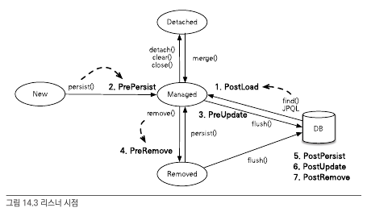
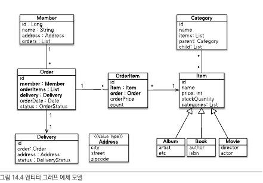

# 컬렉션과 부가 기능

## 컬렉션

@OneToMany, @ManyToMany와 같이 여러 엔티티와 연관과계를 가지는 경우, @ElementCollection을 통해 여러 값을 가지고 있는 경우 컬렉션을 활용한다.

```java
@Entity
public class Team{
	@Id
	private String id;

	@OneToMany
	@JoinColumn
	private Collection<Member> members=new ArrayList<>();
}

Team team=new Team();
team.getMembers().getClass(); //1
em.persist(team)
team.getMembers().getClass(); //2
```

1번의 출력결과는 java.util.Collection이다 하지만, 영속 상태로 저장하게 되면 Hibernate에서는 컬렉션을 효율적으로 관리하기 위해 PersistenceBag라는 타입으로 wrapping해서 내보낸다. 

Hibernate에서는 Colletion type에 따른 여러 래퍼 클래스를 제공한다.

|Collection Interface|Wrapper Class|Duplication|Order|
|--|--|--|--|
|Collection,List|PersistenceBag|O|X|
|Set|PersistenceSet|X|X|
List + @OrderColumn|PersistenceList|O|O|

위와 같이 컬렉션 타입에 따라 다른 방식으로 Wrapping을 진행하기 때문에
아래와 같이 컬렉션은 바로 초기화 시켜주는 것이 중요하다.

```java
List<Member> members=new ArrayList<Member>();
```

### Collection, List

```java
private Collection<Member> members=new ArrayList<>();
```

중복을 허용하고, 순서를 보장하지 않는 컬렉션에 대해서는 ArrayList로 초기화한다. 중복을 허용하기 때문에 add을 이용해서 객체 추가 시 에러가 발생하지 않으며, 동등값 비교를 진행할 때 equals() 메소드를 이용한다.

중복된 엔티티가 있는지 여부를 확인하지 않아도 되므로 식별자 값 확인을 위한 컬렉션 초기화가 발생하지 않는다.

### Set

```java
private Set<> members=new HashSet<>();
```

중복을 허용하지 않는 컬렉션은 Set을 이용한다.

add을 할 때마다, hashCode + equals 메소드를 이용해서 중복된 엔티티가 있는지 여부를 검사해야한다.

그렇기 때문에, 식별자 값 비교를 위한 컬렉션 초기화가 발생하게 된다.

### List + @OrderColumn

```java
@OneToMany(mappedBy="team")
@OrderColumn(name="POSITION")
private Collection<Member> members=new ArrayList<>();


//예제
list.add(1,data1); //1번 자리에 data 추가
list.get(10); //10번 자리의 data 반환
```

위와 같이, ArrayList로 초기화하고 @OrderColumn을 명시하는 경우 순서대로 값을 저장하게 된다. 또한, 위치기반의 저장 및 값 반환도 가능하다. 위와 같이 설정하게 되면, 다쪽에 속한 MEMBER 테이블에 POSITION 이라는 위치 인덱스 컬럼이 생겨서 위치값이 저장된다.(항상 다대일에서 연관된 컬럼값은 다에 보관되게 된다.)

> 단점 

하지만 이런식으로 @OrderColumn을 사용하는 경우 여러 문제가 발생한다.

1. 우선, POSITION 매핑 관련 설정은 연관관계의 주인이 가지고 있지 않고 일대다에서 일에 해당하는 엔티티에 저장된다. 따라서, 다쪽 엔티티에서는 해당 순서값을 알지 못하므로 저장할때는 POSITION에 null 값이 저장되고, 이후에 UPDATE SQL을 통해 초기화 된다.

2. list 내 값을 변경하게 되면 순서 정보도 바뀔 수 있다. 중간에 삭제 되면, 뒤에 있던 컬렉션 내의 순서값들을 변경해줘야한다. 그렇지 않으면 중간에 순서 값이 null로 되어 있어, NullPointerException이 발생할 수 있다.

### @OrderBy

@OrderColumn을 이용하는 것 보다 DB의 ORDER BY를 이용할 수 있는 @OrderBy가 더 좋다.

```java
@OrderBy("username desc, id asc")
private Collection<Member> members=new ArrayList<>();

//예제
Team team=em.find(Team.class,team.getId());
team.getMembers().size(); //컬렉션 초기화 수행
```

저장할때는 순서에 맞지 않게 저장하지만, 이후에 초기화를 진행할때 
위와 같이 @OrderBy로 설정되어 있는 지연로딩된 컬렉션을 초기화 할때 아래 처럼 DB에서 정렬된 상태로 초기화 되게 된다.

```sql
SELECT M.* FROM MEMBER M WHERE M.TEAM_ID=? ORDER BY M.MEMBER_NAME DESC, M.ID ASC
```

## @Converter
컨버터를 이용해서 엔티티의 데이터를 변환해서 DB에 저장할 수 있다.

boolean 타입을 이용하면 0,1의 값으로 저장하게 되는데, 이를 converter을 이용해서 'Y','N' 으로 저장하도록 할 수 있다.

> Member Table
```sql
CREATE TABLE MEMBER(
	ID VARCHAR(255) NOT NULL,
	USERNAME VARCHAR(255),
	VIP VARCHAR(1) NOT NULL,
	PRIMARY KEY(ID)
)
```
> Member Entity

```java
@Getter
@NoArgsConstructor(access = AccessLevel.PROTECTED)
@Entity
public class Member {
    private String id;
    private String name;

    @Convert(converter = BooleanToYNConverter.class)
    private boolean vip;
}
```
> BooleanToYNConverter 

```java
@Converter
public class BooleanToYNConverter implements AttributeConverter<Boolean, String > {
    @Override
    public String convertToDatabaseColumn(Boolean attribute) {
        return (attribute != null && attribute) ? "Y" : "N";
    }
    @Override
    public Boolean convertToEntityAttribute(String dbData) {
        return "Y".equals(dbData);
    }
}
```
위와 같이 Converter을 설정해준다. ```<Before Convert, After Convert>``` 와 같이 AttributeConverter로 generic type을 지정하고 이를 구현한다.

convertToDatabaseColumn: 엔티티에서 DB로 값을 저장할때, 데이터 변환시 사용되는 메소드

convertToEntityAttribute: DB에서 조회한 값을 엔티티의 값으로 변환할때는 사용되는 메소드

위 2개의 메소드에 대해서 override 해주게 되면 원하는 대로 1(True)일때는 'Y', 0(False) 일때는 'N' 이 저장된다.

```java
@Convert(converter = BooleanToYNConverter.class, attributeName = "vip")
@Entity
public class Member {
    private String id;
    private String name;

    private String name;

    private boolean vip;

}
```

위와 같이 필드 레벨이 아닌 클래스 레벨에서 converter을 설정할 수 있는데, 이때는 attrituteName으로 필드를 표시해야된다.

> 모든 동일 type에 대해 converter을 적용하고자 하면???

```java
@Converter(autoApply=true)
public class BooleanToYNConverter implements AttributeConverter<Boolean, String > {
    @Override
    public String convertToDatabaseColumn(Boolean attribute) {
        return (attribute != null && attribute) ? "Y" : "N";
    }
    @Override
    public Boolean convertToEntityAttribute(String dbData) {
        return "Y".equals(dbData);
    }
}
```
autoApply 값을 true로 설정하면 모든 boolean type에 대해서는 converter가 적용된다.

*글로벌 설정에서 제외하고 싶거나 상속 받은 컨버터를 사용하지 않으려면 @Convert의 disableConversion 속성을 true로 설정하면 된다.*

## Listener

JPA 에서는 여러 이벤트가 발생하게 되고, 해당 이벤트에 대해 리스너를 생성할 수 있다.



|Event Types|When|Description|
|--|--|--|
|PostLoad|**(SELECT 직후)**|엔티티가 영속성 컨텍스트에 조회된 직후, 또는 refresh를 호출한 후(2차 캐시에 저장되어 있어도 호출된다.)|
|PrePersist|**(INSERT 직전)**|persist() 메소드를 호출해서 엔티티를 영속성 컨텍스트에 관리하기 직전에 호출된다. 식별자 생성 전략을 사용한 경우에는 엔티티의 식별자는 존재하지 않는 상태이다. 새로운 인스턴스를 merge 할 때도 수행된다.|
|PreUpdate|**(UPDATE 직전)**|flush나 commit을 호출해서 엔티티를 데이터베이스에 수정하기 직전에 호출된다.|
|PreRemove|**(DELETE 직전)**|remove 메소드를 호출해서 엔티티를 영속성 컨텍스트에서 삭제하기 직전에 호출된다. 또한 삭제 명령어로 영속성 전이가 일어날 때도 호출된다. orphanRemoval 에 대해서는 flush나 commit 시에 호출된다.|
|PostPersist|**(INSERT 직후)**|flush나 commit을 호출해서 엔티티를 데이터베이스에 저장한 직후에 호출된다. 식별자가 항상 존재한다. 참고로 식별자 생성 전략이 IDENTITY인 경우 식별자를 생성하기 위해 persist()를 호출하면서 데이터베이스에 해당 엔티티를 저장하므로, 이때는 persist()를 호출한 직후에 바로 PostPersist가 호출된다.|
|PostUpdate|**(UPDATE 직후)**|flush나 commit을 호출해서 엔티티를 데이터베이스에 수정한 직후에 호출된다.(persist 시에는 호출되지 않는다)|
|PostRemove|**(DELETE 직후)**|flush나 commit을 호출해서 엔티티를 데이터베이스에 삭제한 직후에 호출된다.|

필요에 따라서 원하는 이벤트가 수행됬을 때 수행하고자 하는 작업을 설정할 수 있다. DB의 Trigger와 유사한 기능을 수행한다.

### 이벤트 적용 방식

#### Entity Annotations

```java
@Entity
public class Duck {

    @Id @GeneratedValue
    private Long id;

    private String name;
    
    @PostLoad
    public void PostLoad(){
        System.out.println("PostLoad");
    }
    @PrePersist
    public void prePersist(){
        System.out.println("prePersist id:"+id);
    }
    @PreUpdate
    public void PreUpdate(){
        System.out.println("PreUpdate");
    }
    @PreRemove
    public void PreRemove (){
        System.out.println("PreRemove ");
    }
    @PostPersist
    public void PostPersist (){
        System.out.println("PostPersist id: "+id);
    } 
	@PostUpdate
    public void PostUpdate (){
        System.out.println("PostUpdate ");
    }
    @PostRemove
    public void PostRemove(){
        System.out.println("PostRemove ");
    }    
}
```

위와 같이 등록하고, 엔티티를 저장하게 되면

prePersist id:null
postPersist id:1

persist을 통해 엔티티에 식별자값을 부여받은 것을 확인할 수 있다.
prePersist, postPersist 이벤트가 발생하여 위와 같이 출력된다.

#### 별도의 리스너 등록

```java
@Entity
@EntityListeners(DuckListener.class)
public class Duck {
	...
}
public class DuckListener {
    @PostLoad
    public void PostLoad(Object obj){
        System.out.println("PostLoad obj = "+obj);
    }
    @PrePersist
    public void prePersist(Object obj){
        System.out.println("prePersist"+obj);
    }
    @PreUpdate
    public void PreUpdate(Object obj){
        System.out.println("PreUpdate");
    }
    @PreRemove
    public void PreRemove (Object obj){
        System.out.println("PreRemove ");
    }
    @PostPersist
    public void PostPersist (Object obj){
        System.out.println("PostPersist ");
    } @PostUpdate
    public void PostUpdate (Object obj){
        System.out.println("PostUpdate ");
    }
    @PostRemove
    public void PostRemove(Object obj){
        System.out.println("PostRemove ");
    }
}
```

위와 같이 별도의 리스너를 엔티티에 등록하는 것도 가능하다.

#### 기본 리스너

모든 엔티티에 대한 이벤트를 처리하기 위해 기본 리스너를 활용한다.

>META-INF/orm.xml

```xml
<persistence-unit-metadata>
        <persistence-unit-defaults>
            <entity-listeners>
                <entity-listener class="jpabook.jpashop.domain.test.listener.DefaultListener">
                </entity-listener>
            </entity-listeners>
        </persistence-unit-defaults>
    </persistence-unit-metadata>
```

여러 리스너에 대해 우선순위는 아래와 같다.

1. 엔티티
2. 리스너
3. 부모 클래스 리스터
4. 기본 리스너

```java
@Entity
@EntityListeners(DuckListener.class)
@ExcludeDefaultListeners
@ExcludeSuperclassListeners
public class Duck {
	...
}
```
위와 같이 @ExcludeDefaultListeners을 설정하며 기본 리스너 무시,@ExcludeSuperclassListeners을 설정하면 상위 클래스 리스너를 무시하도록 설정할 수 있다.

## Entity Graph

엔티티를 조회 할 때 연관된 데이터를 조회하게 되면, Entity Graph을 이용해서 연관된 데이터에 대한 접근을 수행할 수 있다.

이를 위해 글로벌 페치 전략을 즉시로딩을 하거나, JPQL 페치 조인을 할 수 있다.

1. 글로벌 페치 전략을 즉시로딩으로 하면 매번 즉시 로딩을 수행하게 되므로 성능상 문제가 될 수 있는 부분이 많다.


2. 글로벌 페치 전략을 지연로딩으로 설정하고, JPQL 페치 조인을 활용하게 되면 필요할 때만 연관된 엔티티를 조회하도록 할 수 있다. 하지만 이러한 jpql 페치를 사용하는 경우에도 같은 기능을 수행하는 서로 다른 jpql을 작성해야하는 경우가 발생한다.

```sql
select o from Order o where o.status=?
select o from Order o join fetch o.member where o.status=?
select o from Order o join fetch o.orderItems where o.status=?
```

위를 보면, 모두 주문을 조회하는 jpql이지만 연관된 엔티티가 달라서 모두 다른 jpql을 사용한다.

이른 jpql이 데이터 조회 기능과 연관된 엔티티를 함께 조회하는 기능 2가지 모두를 처리해서 그런데, Entity Graph을 이용하면 jpql는 엔티티 조회 기능에 집중할 수 있게 된다.

즉,
```java
select o from Order o where o.status=?
```
Entity Graph을 이용하면 위의 jpql 만으로 연관된 데이터도 접근할 수 있게 되는 것이다.




### Named Entity Graph

>예제 1

```java
@NamedEntityGraph(
        name = "Order.withMember", // 엔티티 그래프 이름 정의
        attributeNodes = { @NamedAttributeNode("member") } // 함께 조회할 속성 선택
);
@Entity
@Table(name = "ORDERS")
public class Order {
    
    @Id
    @GeneratedValue
    @Column(name = "ORDER_ID")
    private Long id;
    
    @ManyToOne(fetch = FetchType.LAZY, optional = false)
    @JoinColumn(name = "MEMBER_ID")
    private Member member; // 주문 회원
    
}
```

@NamedEntityGraph으로 정적 엔티티 그래프를 생성할 수 있다.

|Values|Descriptions|
|--|--|
|name|엔티티 그래프의 이름 지정|
|attributeNodes|함께 조회할 속성을 지정|

위 처럼, namedentitygraph을 설정하게 되면 Order entity을 조회할 때, member entity도 함께 조회하게 된다.

```java
EntityGraph graph = em.getEntityGraph("Order.withMember");
        
Map hints = new HashMap();
hints.put("javax.persistence.fetchgraph", graph);

Order order = em.find(Order.class, orderId, hints);
```

getEntityGraph 메소드를 이용해서 namedEntityGraph을 가져오고, 이를 jpa 힌트로 넣어 준다. 그런 다음, 조회를 할때, 힌트를 인자로 전달해서 조회를 수행한다. 

그렇게 하면 아래의 sql 같이 자동으로 연관된 엔티티까지 조회를 수행한다.
```sql
select o.*,m.*
from Order o
inner join Member m on o.member_id=m.member_id
where o.order_id=?
```

### Subgraph

만약 Order -> OrderItem -> Item 과 같이 삼중으로 되어 있는 연관관계에 대한 조회를 수행하고자 하면 어떻게 해야할까?

>예제 1

```java
@NamedEntityGraph(
        name = "Order.withAll",
        attributeNodes = { 
                @NamedAttributeNode("member"),
                @NamedAttributeNode(value = "orderItems", subgraph = "orderItems")
        },
        subgraphs = @NamedSubgraph(name = "orderItems", attributeNodes = {
                @NamedAttributeNode("item")
        })
);
@Entity
@Table(name = "ORDERS")
public class Order {

    @Id
    @GeneratedValue
    @Column(name = "ORDER_ID")
    private Long id;

    @ManyToOne(fetch = FetchType.LAZY, optional = false)//필수 관계 설정
    @JoinColumn(name = "MEMBER_ID")
    private Member member; // 주문 회원
    
    @OneToMany(mappedBy = "order", cascade = CascadeType.ALL)
    private List<OrderItem> orderItems = new ArrayList<>();

}

@Entity
@Table(name = "ORDER_ITEM")
public class OrderItem {
    
    @Id
    @GeneratedValue
    @Column(name = "ORDER_ITEM_ID")
    private Long id;
    
    @ManyToOne(fetch = FetchType.LAZY)
    @JoinColumn(name = "ITEM_ID")
    private Item item; // 주문 상품
}
```

위와 같이 설정하게 되면
Order -> Member, Order -> OrderItem , OrderItem -> Item 을 이용해서 조회하게 된다.

단, OrderItem -> Item은 객체 그래프가 아니므로 subgraph으로 등록해줘야한다. subgraph에서 Item 엔티티에 대해 조회를 수행한다.

위의 엔티티 그래프 설정을 통해 아래의 sql문이 실행된다.

```sql
select o.*,m.*,oi.*,i.*
from orders o
inner join Member m on o.member_id = m.member_id
left outer join OrderItem oi on o.order_id=oi.order_id
left outer join Item i on oi.item_id=i.item_id
where o.order_id =?
```
여기서, member만 inner join방식으로 진행된 이유는, 연관관계 설정에 optional = false로 설정해서 필수적인 연관관계가 형성되기 때문이다.

> JPQL 에서 엔티티 그래프 사용

아래와 같이 jpql 힌트를 이용하면 엔티티 그래프를 이용할 수 있다.

```java
List<Order> resultList = em.createQuery("SELECT o FROM Order o WHERE o.id = :orderId", Order.class)
            .setParameter("orderId", orderId)
            .setHint("javax.persistence.fetchgraph", em.getEntityGraph("Order.withAll"))
            .getResultList();
```

**jpql을 사용하게 되면 엔티티 그래프를 사용할 때 기본적으로 outer join을 수행하게 된다. 그래서 inner join 방식을 활용하고자 하면 ```SELECT o FROM Order o JOIN FETCH o.member WHERE o.id = :orderId``` 와 같이 명시해야한다.**

### 동적 엔티티 그래프

```public <T> EntityGraph<T> createEntityGraph(Class<T> rootType);```
createEntityGraph을 이용해서 코드 상으로 entity graph을 만들어 낼 수 있다.

위의 예제들을 동적 엔티티 그래프로 표현해보자

>Entity Graph 예제 1

```java
EntityGraph graph = em.createEntityGraph(Order.class);
graph.addAttributeNodes("member");
        
Map hints = new HashMap();
hints.put("javax.persistence.fetchgraph", graph);

Order order = em.find(Order.class, orderId, hints);
```

> Subgraph 예제 1

```java
EntityGraph graph = em.createEntityGraph(Order.class);
graph.addAttributeNodes("member");
Subgraph<OrderItem> orderItems=graph.addSubgraph("orderItems");
orderItems.addAttributeNodes("item");
        
Map hints = new HashMap();
hints.put("javax.persistence.fetchgraph", graph);

Order order = em.find(Order.class, orderId, hints);
```

### 주의 사항

1. 항상 루트에서 시작해야한다. 항상 엔티티 그래프를 설정한 엔티티를 대상으로 조회를 수행해야한다.

2. 이미 로딩된 엔티티에 대해서는 엔티티 그래프가 수행되지 않는다.

```java
Order order1=em.find(Order.class,orderId);
EntityGraph graph = em.getEntityGraph("Order.withMember");
        
Map hints = new HashMap();
hints.put("javax.persistence.fetchgraph", graph);

Order order2= em.find(Order.class, orderId, hints);
```
위와 같이 하면, order2를 조회하는 시점에는 이미 영속성 컨텍스트에 해당 엔티티가 있어서 엔티티 그래프를 수행하지 않고 이전에 로딩된 엔티티가 반환된다.

3. fetchgraph vs loadgraph

fetch graph을 사용하면 위와 같이 엔티티 그래프에 추가한 엔티티만 조회한다. 하지만, loadgraph을 설정하게 되면 fetchType.Eager로 설정된 연관관계도 포함되어서 조회된다.


## References

book: 자바 ORM 표준 JPA 프로그래밍 -김영한 저

[book_link](https://ultrakain.gitbooks.io/jpa/content/)
