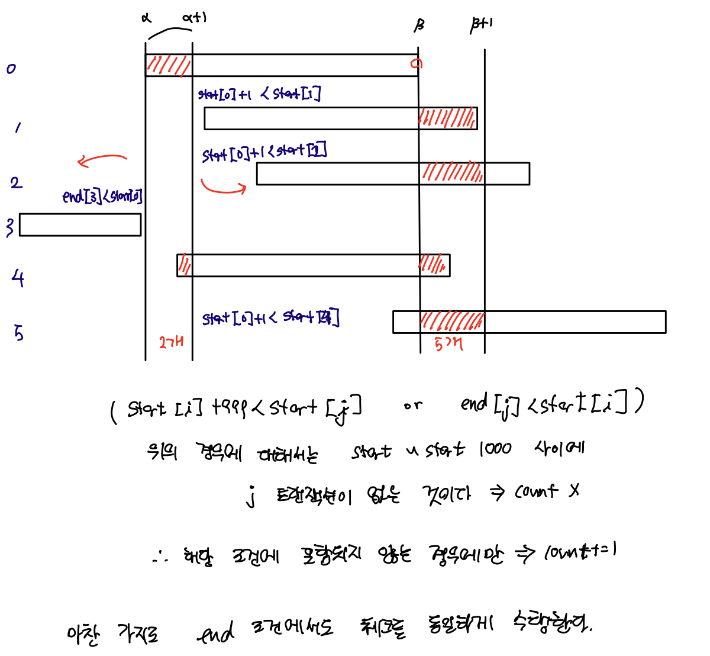

# [Programmers] P17676 추석 트래픽
## [Question](https://school.programmers.co.kr/learn/courses/30/lessons/17676)
## Language: Python

1. 각각의 트랜잭션에 대해서, 파싱을 수행해서 트랜잭션 시작 시간과 끝 시간을 구한다.

2. 각각의 시작 시간, 끝 시간을 리스트에 저장한다.

3. 1초 구간에서 트랜잭션의 개수를 구한다.
    - 3-1. 각각 트랜잭션의 start 지점을 기준으로 1초 간격 사이에 존재하는 트랜잭션의 개수를 구한다.
    - 3-2. 각각 트랜잭션의 end 지점을 기준으로 1초 간격 사이에 존재하는 트랜잭션의 개수를 구한다. 
    - 이때 그림의 로직을 활용해서 해당 구간에 트랜잭션이 수행되는지를 확인할 수 있다.


4. 가장 많은 트랜잭션을 처리하는 구간의 트랜잭션 처리 개수를 저장한다.


## Solution

```python
def solution(lines):
    answer = 0
    length=len(lines)
    
    start_times=[]
    end_times=[]
    #1
    for line in lines:
        fragments=line.split()
        finish_time=fragments[1]
        execution_time=int(float(fragments[2][:-1])*1000)

        finished_mstime=int(finish_time[:2])*60*60*1000 + int(finish_time[3:5])*60*1000 + int(finish_time[6:8])*1000 + int(finish_time[9:])

        start_mstime=finished_mstime - execution_time + 1     
        start_mstime=max(start_mstime,0)
        #2
        start_times.append(start_mstime)
        end_times.append(finished_mstime)
        

    for i in range(length):
        #test for starting time
        count=0
        for j in range(0,length):
            #3-1
            if not(start_times[i]+999 < start_times[j] or end_times[j]<start_times[i]):
                count+=1
        answer=max(answer,count)
        
        count=0
        # test for ending time
        for j in range(length):
            #3-2
            if not(end_times[i]+999 < start_times[j] or end_times[j]<end_times[i]):
                count+=1
        answer=max(answer,count)

    return answer
```
