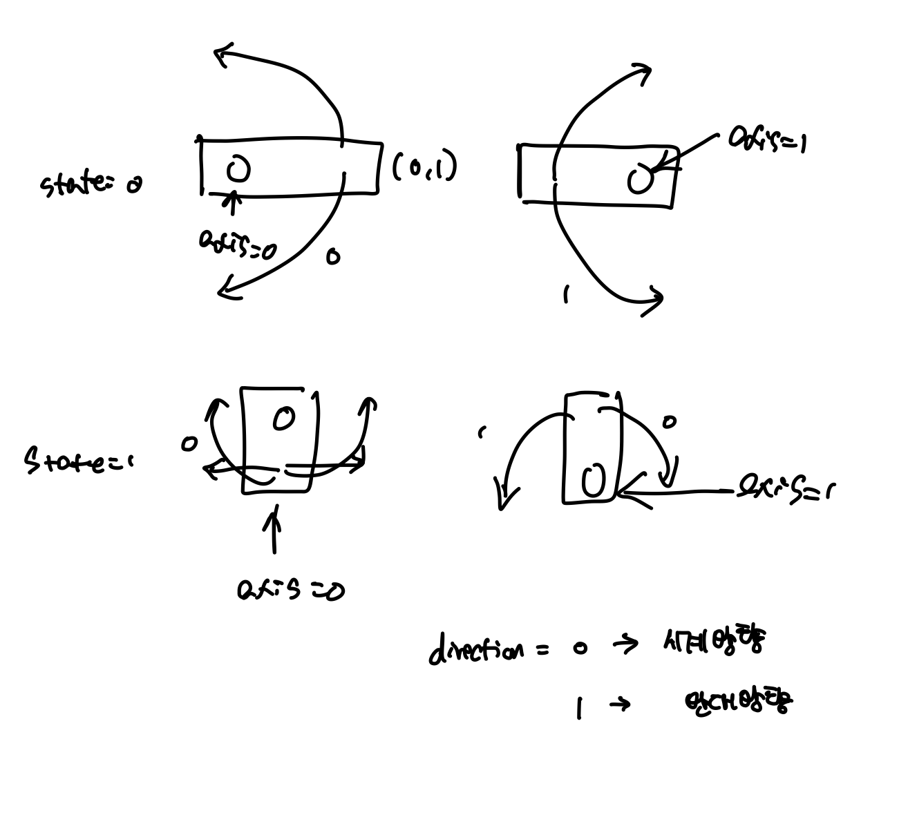

# [Programmers] P60063 블록 이동하기
## [Question](https://school.programmers.co.kr/learn/courses/30/lessons/60063)
## Language: Python

주어진 문제는 기존의 최단 경로 찾기를 응용한 문제이다. 로봇의 위치는 한개의 좌표가 아닌 2개의 좌표로 나타낸다.

해당 로봇은 평행이동 및 회전을 수행할 수 있다.

평행 이동의 경우 상하좌우의 방향으로 한칸씩 수행가능하며
회전의 경우, 회전축에 따라 시계방향과 시계반대방향으로 회전을 수행할 수 있다.



위의 그림을 통해 회전 할 수 있는 경우가 state/axis/direction 별로 8가지의 경우가 있음을 확인할 수 있다.

> rotation

```python
#state,axis,direction
dy=[[[1,-1],[-1,1]],[[0,0],[0,0]]]
dx=[[[0,0],[0,0]],[[-1,1],[1,-1]]]
```
state/axis/direction 별로 x,y 이동방향이 8가지로 설정해놓는다.

> 회전 반경 조사

```python
for axis in range(2):
    for direction in range(2):
        #회전한 이후의 좌표
        row,col=pos[axis]
        new_row=row+dy[state][axis][direction]
        new_col=col+dx[state][axis][direction]
        new_pos=(new_row,new_col)
        
        #회전 반경에 있는 좌표
        non_axis_row,non_axis_col=pos[1-axis]
        temp_row=non_axis_row+dy[state][axis][direction]
        temp_col=non_axis_col+dx[state][axis][direction]
        temp_pos=(temp_row,temp_col)
        if 0<new_row <=n and 0<new_col <=n and 0<temp_row <=n and 0<temp_col <=n:          
            #회전 반경에 벽이 있는지 여부 조사
            if board[new_row-1][new_col-1]==0 and board[temp_row-1][temp_col-1]==0:
```

각각의 상태에서 axis/direction에 대해 4가지의 경우를 회전을 수행할 수 있는데, 그때, 회전 한 이후의 좌표값이 지도 내부에 있는지를 확인해야되며, 회전 반경 안에는 모두 빈칸이어야한다.

나머지는, bfs을 통한 최단 경로를 찾는 알고리즘과 유사하다.
## Solution

```python
from math import inf
from collections import deque
def move(n,board,pos,state):
    results=[]
    
    #parallel movement
    head=pos[0]
    tail=pos[1]
    movement=[(0,1),(1,0),(0,-1),(-1,0)]
    for dir in range(4):
        new_head=(head[0]+movement[dir][0],head[1]+movement[dir][1])
        new_tail=(tail[0]+movement[dir][0],tail[1]+movement[dir][1])
        
        if 0<new_head[0]<=n and 0<new_head[1]<=n and 0<new_tail[0]<=n and 0<new_tail[1]<=n:
            if board[new_head[0]-1][new_head[1]-1]==0 and board[new_tail[0]-1][new_tail[1]-1]==0:
                results.append(((new_head,new_tail),state))
        
    #state,axis,direction
    dy=[[[1,-1],[-1,1]],[[0,0],[0,0]]]
    dx=[[[0,0],[0,0]],[[-1,1],[1,-1]]]
    
    for axis in range(2):
        for direction in range(2):
            #회전한 이후의 좌표
            row,col=pos[axis]
            new_row=row+dy[state][axis][direction]
            new_col=col+dx[state][axis][direction]
            new_pos=(new_row,new_col)
            
            #회전 반경에 있는 좌표
            non_axis_row,non_axis_col=pos[1-axis]
            temp_row=non_axis_row+dy[state][axis][direction]
            temp_col=non_axis_col+dx[state][axis][direction]
            temp_pos=(temp_row,temp_col)
            
            #회전 이후의 좌표가 맵 안에 있는 경우
            if 0<new_row <=n and 0<new_col <=n and 0<temp_row <=n and 0<temp_col <=n:          
                #회전 반경에 벽이 있는지 여부 조사
                if board[new_row-1][new_col-1]==0 and board[temp_row-1][temp_col-1]==0:
                    results.append(((pos[axis],new_pos),1-state))
    return results
        
    
def solution(board):
    answer = 0
    n=len(board)
    
    queue=deque([(((1,1),(1,2)),0,0)])
    visited=set([((1,1),(1,2))])
    
    while True:
        current_position,state,count=queue.popleft()
        #끝에 도달한 경우 bfs를 종료한다.
        if (n,n) in current_position:
            answer=count
            break
        #이동할 수 있는 경우의 수를 조사한다.
        candidate_movements=move(n,board,current_position,state)
        for candidate_position,state in candidate_movements:
            #이미 방문한 좌표인 경우 해당 좌표에대한 조사를 생략한다.
            if candidate_position in visited:
                continue
            queue.append((candidate_position,state,count+1))
            visited.add(candidate_position)

    return answer
```
