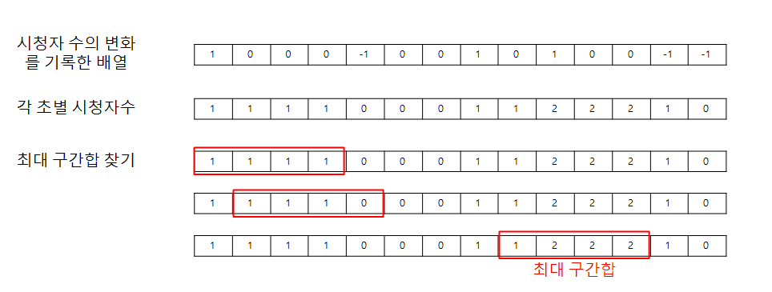

# [Programmers] P72415 카드 짝 맞추기
## [Question](https://school.programmers.co.kr/learn/courses/30/lessons/72415)
## Language: Python




해당 문제는 주어진 카드 쌍이 나열된 지도에서 같은 카드를 2개를 뽑으면 카드를 지우는 흔한 카드 짝 찾기 게임이다.

해당 문제를 dfs을 이용해서 처음 부터 끝까지 모든 경우의 수에 대해서 조사하려고 하면 시간 초과가 난다.

이 문제를 풀이하기 위해서는 카드 쌍의 종류가 매우 적은 것에 집중해야한다. 최대 6쌍의 카드가 존재한다. 따라서 어떠한 카드를 뽑을 순서를 미리 순열을 통해 구한뒤 해당 카드 순서에 따라 카드를 뽑았을때, 최소 이동 거리를 가지는 카드 순열을 구하면 된다.

가령 카드 종류가 1,2,3 이라고 할때,

1,2,3
1,3,2
2,1,3
2,3,1
3,1,2
3,2,1

이렇게 총 6가지가 존재한다.

그러므로 6가지 경우의 수에 대해서만 조사하면 된다. 단, 카드는 쌍으로 지워야하므로, 앞의 카드를 먼저 지웠을 경우와 뒷 카드를 먼저 지웠을 경우를 나눠서 경우를 생각한다.

1. move 함수
    - 한 칸만 이동하는 함수
    - cltr 이동하는 함수
2. bfs 구현


# Solution 

```python
from math import inf
from collections import deque,defaultdict
from itertools import permutations
from copy import deepcopy

def bfs(board,row,col,target_row,target_col):
    visited=[[False] *4  for _ in range(4)]   
    queue=deque([(row,col,0)])
    movements=[(-1,0),(0,1),(1,0),(0,-1)]
    
    while queue:
        row,col,count=queue.popleft()       
        if row==target_row and col==target_col:
            return count + 1
        
        if visited[row][col]:
            continue
            
        visited[row][col]=True

        #칸 이동
        for direction in range(4):
            #한 칸 이동
            target_movement=movements[direction]   
            new_row=row+target_movement[0]
            new_col=col+target_movement[1]
            
            if new_row < 0 or new_row >=4 or new_col < 0 or new_col>=4:
                continue
            queue.append((new_row,new_col,count+1))
            
            #여러칸 이동
            for times in range(1,5):
                new_row=row+target_movement[0]*times
                new_col=col+target_movement[1]*times
                # 끝까지 이동한 경우 해당 방향의 마지막 칸으로 이동한다..
                if new_row < 0 or new_row >=4 or new_col < 0 or new_col>=4:
                    new_row=row+target_movement[0]*(times-1)
                    new_col=col+target_movement[1]*(times-1)
                    queue.append((new_row,new_col,count+1))
                    break
                # cltr 이동을 하다가 카드를 만나게 되면 이동을 멈춘다
                if board[new_row][new_col] != 0:
                    queue.append((new_row,new_col,count+1))
                    break
                
def solution(board, r, c):    
    answer = 0
    card_positions=defaultdict(list)
    
    # 카드 쌍을 분류해서 카드 종류 별로 위치를 파악한다.
    for i in range(4):
        for j in range(4):
            if board[i][j]!=0:
                card_positions[board[i][j]].append((i,j))
    
    card_types=list(card_positions.keys())
    
    min_count=inf
    #모든 카드 순열에 대해 비용 조사해서 최소 비용 값을 구한다.
    for card_permutation in permutations(card_types):
        count=0
        row,col=r,c
        temp_board=deepcopy(board)
        for card_type in card_permutation:    
            prev_card=card_positions[card_type][0]
            post_card=card_positions[card_type][1]
            
            #앞 카드 먼저
            prev_count=bfs(temp_board,row,col,prev_card[0],prev_card[1])+bfs(temp_board,prev_card[0],prev_card[1],post_card[0],post_card[1])
            #뒷 카드 먼저
            post_count=bfs(temp_board,row,col,post_card[0],post_card[1])+bfs(temp_board,post_card[0],post_card[1],prev_card[0],prev_card[1])

            if prev_count < post_count:
                row,col=post_card
                count+=prev_count
            else:
                row,col=prev_card
                count+=post_count

            #카드 쌍을 지도에서 지워준다.
            temp_board[prev_card[0]][prev_card[1]]=0
            temp_board[post_card[0]][post_card[1]]=0

        min_count=min(min_count,count)
        answer=min_count
            
    return answer
```