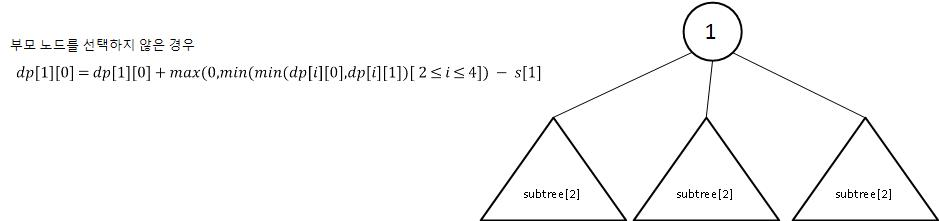

# [Programmers] P72416 매출 하락 최소화
## [Question](https://school.programmers.co.kr/learn/courses/30/lessons/72416/)
## Language: Python

해당 문제는 팀장 - 팀원 관계가 형성되어 있는 트리 형태의 문제로 풀이할 수 있다. 이때, 팀에서 최소 한명의 인원이 워크숍에 참석해야하는데, 이를 구하기 위해 리프 노드에서 부터 차례대로 dfs를 통해 처리하면서 루트 노드까지 접근해야한다. 이떄, 중간중간에 최소 매출액을 유지하기 위한 Memoization을 해야한다.

루트 와 서브 트리간의 관계를 아래와 같이 2가지 경우에 대해서 고려할 수 있다.

> 루트(부모) 노드를 선택하는 경우


이때는 위의 그림과 같이, 자식 노드에 저장되어 있는 값들 중에서 최소값들의 합을 선택해주면 된다.(부모 노드를 선택하기 때문에 자식 노드는 선택을 해도 되고, 안해도 된다.)

> 루트(부모) 노드를 선택하지 않는 경우

.

부모 노드를 선택하지 않는 경우, 반드시 자식 노드 중에 하나는 참석해야한다. 이때, 자식 노드를 선택했을 경우와 선택하지 않았을 때의 경우에 발생되는 손해가 가장 작은 값을 선택해준다.
손해가 가장 작은 값을 기존에 루트 노드를 선택하는 경우에 추가해주고 루트 노드의 매출액 값을 빼주면 원하는 결과를 얻을 수 있다.

**이 문제의 핵심 포인트는 자식 노드의 손해값 중 가장 작은 값을 찾아주는 과정이다.**

# Solution 

```python
from math import inf
sale_info=[]
graph=[]
dp=[]
def dfs(vertex): 
    global dp
    childs=graph[vertex]
    
    #자식 노드가 없는 경우    
    if len(childs)==0:
        return
    
    min_difference=inf
    for child in graph[vertex]:
        dfs(child)
        #부모를 선택하는 경우에는 자식들은 최소값을 취하면된다
        dp[vertex][1]+=min(dp[child])
        #자식의 손해값 계산
        min_difference=min(min_difference,dp[child][1]-dp[child][0])
    #손해값이 음수가 되는 경우는 없다
    min_difference=max(0,min_difference)
    #손해값에 대해 계산을 한다.
    dp[vertex][0]=dp[vertex][1]+min_difference-sale_info[vertex]
         
def solution(sales, links):
    global sale_info,graph,dp
    sale_info=sales
    n_vertex=len(sales)
    
    graph=[[] for _ in range(n_vertex)]
    dp=[[0,sales[v]] for v in range(n_vertex)]
    
    for v1,v2 in links:
        graph[v1-1].append(v2-1)
        
    dfs(0)
    answer = min(dp[0])
    return answer
```